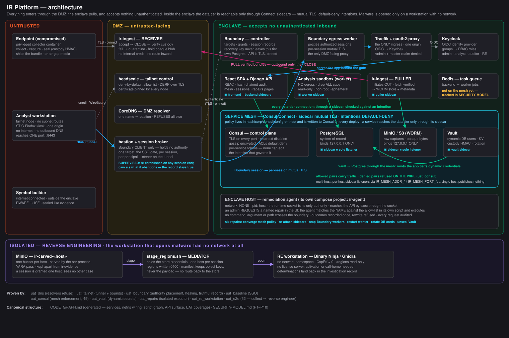
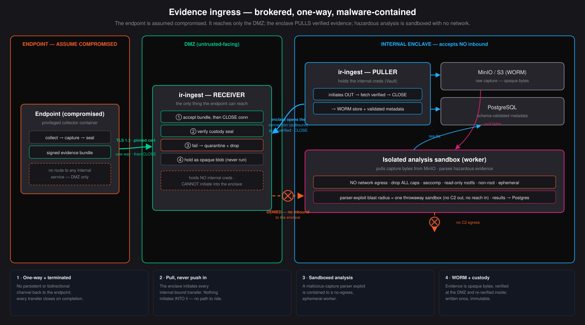
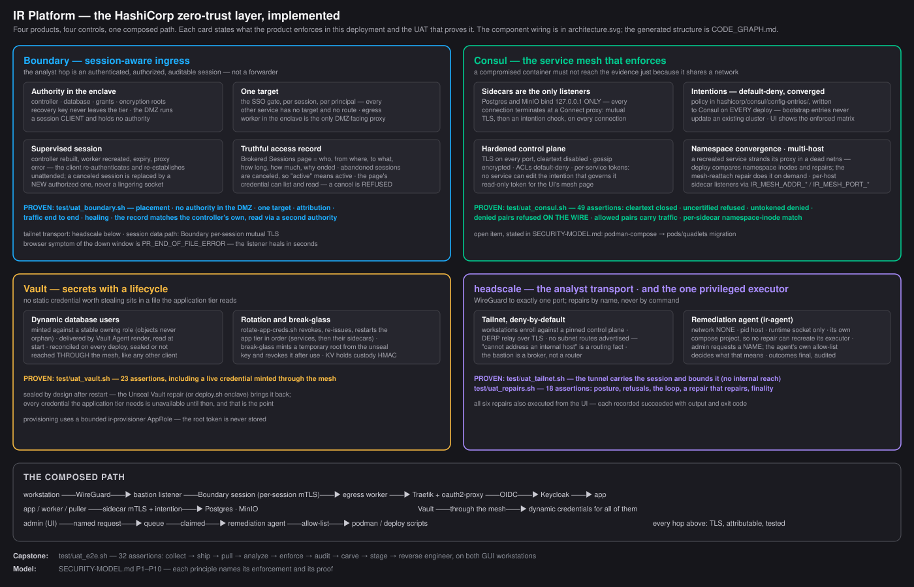

# DFIR Framework — the platform

The served half of the framework. The offline host toolkit ([`../toolkit/`](../toolkit/))
covers the endpoint; everything after it happens here — evidence sealed at collection,
shipped inward, analyzed server-side, correlated across hosts, adjudicated by named
analysts, written up, and finally archived, with every hand that touched it recorded.

It is built for a specific operating assumption: **the endpoint under investigation may be
compromised, and the evidence itself is hazardous.** Where components sit, which direction
connections open, and what the analysis worker is permitted to do all follow from that.

**▶ [Watch the walkthrough](img/concept_demo_alpha.mp4)** — a case worked end to end
through the interface.

---

## The lifecycle

The framework is organized around the five stages of the digital forensics process. They are
not a diagram on a wall: they are the columns of the case board, the order the work moves
in, and the structure of the report at the end. Movement between them is free in both
directions, because evidence arriving late genuinely sends work back.

| Stage | What happens | Where it lives |
|---|---|---|
| **Identification** | Collect the right evidence, sealed at the point of collection — and say which machines could *not* be collected | Collector, DMZ receiver, enclave puller |
| **Preservation** | Custody verified on arrival and again inward, then continued as a hash-chained ledger; retention and legal hold | Custody chain, `CustodyEvent`, retention lifecycle |
| **Analysis** | Memory analyzed in a sandbox with no egress; the engine proposes and an analyst decides; hosts correlated into campaigns | Analysis worker, investigation engine, correlation |
| **Documentation** | The investigation record — notes, verdict changes with their stated reasons, reverse-engineering determinations, and what was ruled **out** | Investigation record, case board, curated tags |
| **Presentation** | Two reports generated from the case's own rows and typeset to PDF inside the enclave | Report builder, export ledger |

After the case: conclusion, automatic archival to cold storage, and restore. An archived case
never disappears — it stays listed, marked cold, and comes back verified against its seal.

**The whole path in the order it actually happens:
[`WORKFLOW-LIFECYCLE.md`](WORKFLOW-LIFECYCLE.md).**
Every capability, and what the framework refuses to do: [`USER-GUIDE.md`](USER-GUIDE.md).

---

## What it does

**Consolidates investigations.** Findings, IOCs, principals, custody records, and
memory-analysis results from every collected host land in PostgreSQL. "Have we seen this
indicator, host, or technique before?" is a query across the whole corpus.

**Analyzes memory server-side.** Endpoints capture RAM; the platform analyzes it. Because the
capture is retained as an object rather than consumed in place, it can be re-analyzed later
against improved detections.

**Preserves chain of custody end to end.** Evidence is sealed at collection, verified before it
is accepted, and re-verified before ingest. Custody events continue in the database as a
hash-chained ledger. A lawful purge records the pre-purge hash, so deletion remains provable.

**Manages evidence retention.** After analysis, a clean host's capture is purged from object
storage while its metadata and results are kept; a compromised host's capture is retained as
evidence. Administrators can place a capture under legal hold.

**Enforces role separation.** Identity comes from Keycloak. `admin` has full control including
deletion; `analyst` works cases end-to-end — notes, rescans, investigation — without deletion
rights; `auditor` reads investigations and the complete audit trail. Every mutation and
privileged read is recorded in an append-only, hash-chained audit log, re-verified on read.

**Bounds what leaves.** `export` is a right held alongside the role, not a consequence of being
able to read: reading a finding inside the enclave and carrying ten thousand of them out are
different acts, and the enclave exists to bound the second. An auditor sees everything and
exports nothing unless granted it. Every export — and every refused one — lands in an export
ledger that answers what left, under whose name, in what volume, and to where.

**Validates remediation.** An analyst can initiate a rescan of a host from the web application
to confirm eradication held or that a host was restored to a known-good baseline; the follow-up
collection is diffed against its baseline.

---

## The web application

Analysts work cases through an SSO-gated web application: a drill-down dashboard, findings
with database-side search and filtering, per-run evidence and memory-analysis detail,
multi-host correlation with an attack graph and timeline, cross-investigation IOC search,
the audit trail, and — for administrators — user management and platform health.

**See [`UI_OVERVIEW.md`](UI_OVERVIEW.md) for the application screen by screen.**

---

## Architecture



The framework deploys as separate tiers, each on its own hardware:

| Tier | Contains |
|---|---|
| **Enclave** | PostgreSQL, object storage, task broker, API, analysis sandbox, Keycloak, SSO gate, ingress, service mesh, evidence puller, resolver |
| **DMZ** | Evidence receiver, bastion broker, connection distributor, tailnet control plane, resolver |
| **Analyst workstation** | Hardened browser, tailnet node |
| **RE workstation** | Binary Ninja or Ghidra, opened on carved regions with no network |
| **Collector** | Collection container, run on the endpoint under investigation |
| **Symbol builder** | Builds kernel symbol tables offline; never touches evidence |

Services address each other **by name**. The container runtime's resolver tracks where each one
currently is, so a network can be recreated on a different subnet and a second analyst
workstation can start without colliding with the first. The only addresses written down are the
two resolvers' own, because `resolv.conf` holds literals and a resolver cannot be found by
asking a resolver.

### Evidence ingress



An endpoint reaches **only a DMZ receiver**, over a channel that closes on receipt. The
receiver verifies the custody seal, holds the bundle as an opaque blob, holds no internal
credentials, and has no route into the enclave.

The upload is **TLS 1.3, with the collector pinning the receiver's certificate**, and both ends
refuse to fall back to plaintext. What crosses that connection is a memory image — every
credential, key, token and open file the host had in RAM — and an endpoint under suspicion is
usually on a segment the responder neither controls nor trusts. The custody seal proves the
bundle was not *altered*; it does nothing to stop it being *read*. Server authentication is what
stops the collector handing a host's memory to whoever answers on that address.

The **enclave pulls**: an internal component initiates outbound to the DMZ, fetches verified
bundles, and closes the connection. Nothing is ever initiated into the enclave, so a
compromised endpoint — or a compromised DMZ host — has no inbound path to traverse.

Hazardous evidence is parsed only in an **isolated analysis sandbox**: no network egress, all
capabilities dropped, read-only root filesystem, non-root, ephemeral. A parser exploit is
contained to a disposable worker that can neither reach an internal service nor call out.

### Analyst access



Analyst workstations join a self-hosted tailnet whose policy is an explicit allow-list with no
subnet routes, so a workstation cannot address an internal host. The tailnet admits **one
port** on the bastion; nothing else has a forwarder.

Behind that port the bastion holds **several independent Boundary sessions**, each on a
loopback address, each supervised on its own. A layer-4 distributor owns the analyst-facing
port and spreads connections across them, retrying past a session that has died. One shared
session would be a fleet-wide failure domain: when it ends, every analyst riding it drops
together. The sessions are unreachable from any network, so no workstation can pin itself to
one and re-create that. The distributor terminates no TLS and holds no credentials — the
analyst's connection stays encrypted from the workstation to the SSO ingress.

Everything the browser touches is served from **one origin**, path-routed at the ingress:

| Path | Serves | Gated |
|---|---|---|
| `/realms/irplatform/*` | Keycloak login | no |
| `/oauth2/*` | SSO sign-in and callback | no |
| `/` | Web application and API | yes |
| `/admin`, `/realms/master` | Keycloak administration | **refused** |

Every network is `internal`: no route off the host, so nothing on the analyst segment can reach
the internet regardless of what it resolves. Each tier additionally runs a resolver that answers
only in-zone names and **REFUSES** everything else, with no forwarders and no recursion. The
enclave's permits exactly one cross-tier name — the receiver the puller dials outbound — and no
DMZ host can resolve an enclave name in return. The analyst-facing platform name resolves to the
**bastion**, never to an internal address, so a workstation never learns an enclave address even
by resolution. The analyst browser
is policy-hardened: no add-ons, telemetry, password manager, sync, or developer tools; TLS 1.2
floor; clipboard access denied; confined to the platform origin.

### Administrative access

Management interfaces — MinIO console, Keycloak administration, Consul, PostgreSQL, the
evidence receiver — are **not published**. An admin logs into the host that owns a tier and
opens a forwarder for that tier only, then closes it when the work is done
([`admin/`](admin)):

```bash
admin/adminctl.sh up enclave --ttl 30m
admin/adminctl.sh down enclave
```

There is one forwarder per tier, each joined only to that tier's network, so the DMZ side
has no route to an enclave service and the enclave side has no route into the DMZ. Host
ports bind the management address, never every interface. Keycloak administration is
performed this way, never through the analyst path.

### Evidence export

Analysts export findings as CSV or JSON and indicators as an IOC bundle — a handoff is how
incident response ends, so the platform supports it rather than forcing transcription.

Export is therefore not prevented; it is bounded and recorded:

- **Every export is audited.** The actor, format, filters applied and row count are written to
  the hash-chained ledger, so what left and who took it stays reconstructable.
- **The workstation has no egress path.** A downloaded file lands in the kiosk container's
  ephemeral filesystem, which has no internet route, no clipboard, no removable media, and one
  brokered port that reaches the platform and nothing else. The file cannot leave over the
  network.
- **Moving data off the kiosk is an operator action**, taken outside the browser's reach and
  outside the analyst path — so it is a decision someone makes, not a side effect of viewing a
  case.

The boundary is the workstation, not the screen: evidence can be read and exported inside the
contained session, and leaving that session is an explicit, auditable act.

### Identity and secrets

Users are created in the web application by an administrator and provisioned into Keycloak in
the group matching their role; that group is what the platform maps to an RBAC role at login.

The application tier holds no static database credentials. Vault issues short-lived PostgreSQL
credentials and supplies application secrets; issued users act as a fixed owner role, so object
ownership is stable across credential rotation.

---

## Layout

| Path | Contents |
|---|---|
| [`backend/`](backend) | API, task workers, data model, object-store client, RBAC, audit, retention |
| [`frontend/`](frontend) | Web application |
| [`collector/`](collector) | Endpoint collection container |
| [`dmz/`](dmz) | Evidence receiver (DMZ) and puller (enclave) |
| [`workstation/`](workstation) | Hardened analyst browser |
| [`hashicorp/`](hashicorp) | Vault, Keycloak realm, tailnet/broker/DNS, service-mesh configuration |
| [`traefik/`](traefik) | TLS ingress and routing |
| [`shared/`](shared) | Chain-of-custody module |
| [`deploy/`](deploy) | Per-tier deployment |
| [`test/`](test) | Acceptance tests |
| [`troubleshooting/`](troubleshooting) | Diagnostics and fault isolation |
| [`admin/`](admin) | On-demand administrative access, per tier |

## Documentation

| Document | Covers |
|---|---|
| [`USER-GUIDE.md`](USER-GUIDE.md) | **Start here.** Every capability, where it lives, and what the platform refuses — including what is deliberately not built |
| [`WORKFLOW-LIFECYCLE.md`](WORKFLOW-LIFECYCLE.md) | One case from collection to report, in the order it happens |
| [`WORKFLOW-ANALYST.md`](WORKFLOW-ANALYST.md) | Working an incident: adjudication, triage, the investigation record |
| [`WORKFLOW-RE.md`](WORKFLOW-RE.md) | Carved regions: staging a session, determinations, purge |
| [`WORKFLOW-ADMIN.md`](WORKFLOW-ADMIN.md) | Deployment, management access, accounts, symbols, retention |
| [`WORKFLOW-AUDITOR.md`](WORKFLOW-AUDITOR.md) | Audit trail, chain verification, export, custody |
| [`UI_OVERVIEW.md`](UI_OVERVIEW.md) | The web application, screen by screen |
| [`SECURITY-MODEL.md`](SECURITY-MODEL.md) | The principles, what enforces each, and the test that proves it |
| [`CODE_GRAPH.md`](CODE_GRAPH.md) | Generated dependency graph: services, wiring, scripts, API surface, UAT coverage — regenerate with `gen_code_graph.py` after adding logic |
| [`CHANGE-MANAGEMENT.md`](CHANGE-MANAGEMENT.md) | Read before making a change: ground rules, blast radius per change type, the document inventory, and the obligations a change carries |
| [`troubleshooting/TOPOLOGY.md`](troubleshooting/TOPOLOGY.md) | Component topology: every hop, its port and protocol, and what refuses it |
| [`re-workstation/README.md`](re-workstation/README.md) | The RE tier: containment, staging, tool selection |
| [`admin/README.md`](admin/README.md) | Administrative access to management interfaces, per tier |
| [`deploy/README.md`](deploy/README.md) | Deployment: configuration, staged rollout, per-tier installation, running a collection |
| [`deploy/NETWORKING.md`](deploy/NETWORKING.md) | Network design: VLANs, routing, firewall policy, IDPS placement, DNS |
| [`troubleshooting/COMPONENTS.md`](troubleshooting/COMPONENTS.md) | Component reference: configuration, network path, and health probe for every hop |
| [`troubleshooting/RUNBOOK.md`](troubleshooting/RUNBOOK.md) | Symptom-to-resolution runbook |
| [`change_logs/`](change_logs/) | What changed, and the assertion that proves it |
| [`../planning/ROADMAP-FORENSIC-PLATFORM.md`](../planning/ROADMAP-FORENSIC-PLATFORM.md) | Roadmap and delivery status |

## Requirements

Linux, with Podman and `podman-compose`. Collection targets Linux endpoints.

## Quick start

```bash
cd deploy
cp .env.example .env      # set secrets before any real deployment
./deploy.sh all
```

Deployment is staged: each stage gates on a health check, the SSO chain is validated before the
analyst browser starts, and evidence is seeded so the platform is populated on first login.
See [`deploy/README.md`](deploy/README.md) for per-tier installation and configuration.

---

## Implementation status

Implemented and validated end to end: evidence ingress, chain of custody, server-side memory
analysis, retention, RBAC and audit, SSO, multi-host correlation, and the analyst web
application.

**Validated through UAT** against real evidence — collection, custody-sealed ingress,
server-side Volatility analysis of a 24 GB capture, adjudication by the investigation engine,
carved-region reverse engineering on an isolated workstation, and the audit and retention paths
around them. Assertions run against the deployed stack rather than fixtures.

Treat this as a working reference implementation of the architecture and workflow rather than a
tuned detection product. Detection depth is an ongoing track; the surrounding system — ingress,
custody, retention, RBAC, audit, correlation — is complete and exercised.

**Defects are tracked and fixed.** UAT exercised the Linux memory-analysis path in depth and
surfaced gaps in existing detection logic; those are recorded as remediation items in
[`planning/BACKLOG.md`](../planning/BACKLOG.md) §12a. Each fix is recorded in
[`change_logs/`](change_logs/) with the evidence that found it, what changed, and what
remains open.

**Endpoint coverage is Linux.** The collection container, the memory analysis path, the
investigation engine and the reverse-engineering flow are all exercised against Linux hosts.
The architecture is platform-agnostic — evidence ingress, custody, retention, RBAC, audit and
correlation make no assumption about the endpoint's operating system, and the finding schema is
shared. What is absent is per-platform collection and detection depth, not the surrounding
system.

## Roadmap

Ordered and detailed in
[`planning/CONSOLIDATED-BACKLOG.md`](../planning/CONSOLIDATED-BACKLOG.md); the design decisions
behind it, and their open questions, are in
[`planning/DECISIONS.md`](../planning/DECISIONS.md).

| Track | Covers |
|---|---|
| Windows endpoint support | AFF4 collection (go-winpmem) and MemProcFS-based analysis |
| High-performance evidence pipeline | Resumable chunked ingest of multi-GB memory images (AFF4 / raw / LiME), and the derivation chain over what is extracted from them |
| Parallel analysis capacity | Scaling memory analysis across workers and hosts for fleet-scale intake |
| Horizontal data scalability | Streaming/resumable evidence pipeline, distributed object storage, capacity sizing |
| Sharded SQL metadata storage | Optional horizontal partitioning of the metadata stores |
| Campaign correlation models | Beyond shared-indicator clustering — scoring, confidence modeling, actor attribution |
| UI enhancements | Case management, visualization with drill-down, data management |
| Web Server SRG | DISA Web Server SRG hardening of the web tier and its runtime |
| Ansible automation | Multi-host deployment and host preparation, lint-gated |

### Parallel analysis — configuration and sizing

The platform analyzes **N captures at once**: one queue, N workers, each taking one capture.
Proven by `test/uat_workers.sh` — five workers draining a 25-endpoint surge with six analyses
in flight at one instant, every capture analyzed exactly once, every analysis attributed to
the worker that ran it.

**Configuration** (`deploy/.env`):

| Setting | Default | Meaning |
|---|---|---|
| `IR_WORKER_REPLICAS` | `1` | Workers, primary included. `5` runs worker + worker-2..5. Raising it stamps replica pairs from a generator; lowering it removes and deregisters the excess on the next deploy. |
| `IR_IP_WORKERn` | `.213+` | One static address per replica — configuration, not discovery. |
| `IR_VOL3_TIMEOUT` | `10800` | Bounds one analysis; the broker's visibility timeout derives from it. Raising one without the other redelivers a running analysis mid-pass. |
| `IR_YARA_PROC_TIMEOUT` | — | Bounds the per-process YARA scan; too low costs matches *and* the carved regions that come from them (reported as *YARA Scan Coverage Incomplete*). |
| `IR_S3_CONCURRENCY` | low | Staging transfer concurrency. Where the object store and scratch share a device, one aggressive transfer makes the store report its own drive unhealthy. |

**Sizing rules** — each concurrent analysis costs, independently:

- **Scratch disk:** one full capture staged per slot. `N × largest supported capture`, plus
  carve headroom, must fit the filesystem backing the scratch volumes. Every replica has its
  own volume so no analysis can evict another's staging.
- **CPU:** one Volatility pass saturates a core and bursts wider. Budget ≥ 1.5 cores per
  slot; replicas run `CELERY_CONCURRENCY=1` so an OOM kills one analysis, not two.
- **Memory:** analyzer working set scales with capture size; 4–8 GB per slot for real
  captures.
- **Postgres:** `max_connections ≥ 60 (base tier) + 3 × workers`. At the defaults (100),
  the wall is ~13 workers; raise it before raising the fleet past that.
- **I/O separation:** object store and scratch on separate devices is the prerequisite for
  any real concurrency — the staging copy is the bottleneck, not CPU.

**Phase caps.** 50 workers is the supported ceiling for this phase (the enterprise-surge
target: a SIEM flags a fleet, memory arrives from every host at once). 43 replicas is the
single-host address ceiling — past one host, capacity means analysis hosts on the multihost
mesh, and automatic provisioning of those is the Nomad/Ansible track. Per-capture latency is
unchanged (a 24 GB capture is still 75–100 minutes); parallelism buys fleet throughput, so a
20-host incident at 5 workers is an afternoon rather than a day.
