# Web application — screen by screen

The analyst-facing surface of the IR Platform. Every screen below is served from one
SSO-gated origin and reached through the brokered analyst path described in
[`README.md`](README.md).

Navigation is role-aware: `analyst` sees the investigative views, `reverse_engineer`
additionally sees the reverse-engineering queue, `auditor` additionally sees the audit
trail, and `admin` additionally sees user management and platform health. Controls a role
cannot use are not rendered.

Role workflows: [`WORKFLOW-ANALYST.md`](platform/WORKFLOW-ANALYST.md),
[`WORKFLOW-RE.md`](platform/WORKFLOW-RE.md), [`WORKFLOW-ADMIN.md`](platform/WORKFLOW-ADMIN.md),
[`WORKFLOW-AUDITOR.md`](platform/WORKFLOW-AUDITOR.md).

---

## Sign-in

Authentication is Keycloak. The application holds no password of its own — sessions come
from the identity provider, and roles come from Keycloak groups.

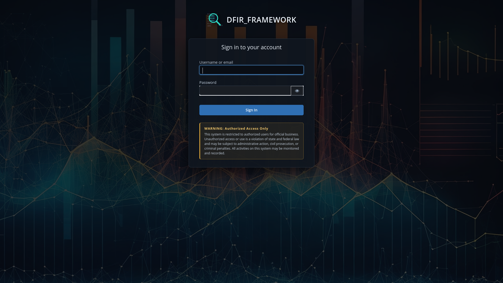

Signing out ends the application session **and** the Keycloak session, so returning to the
platform requires authenticating again rather than silently resuming.

**Deployment awareness.** Every screen polls the running build and the API's process start
time. When either changes, a banner states that this tab is running a superseded version or
that the API restarted, and offers a reload. Nothing reloads on its own: an analyst may be
part-way through a justification, and discarding that to pick up a new build is the worse
outcome. When the API is briefly unreachable, the banner says so and the page keeps showing
the data it last loaded.

---

## Dashboard

Where to be looking right now, across every investigation. The headline tiles each drill to
the view behind their number. The Backlog panel is the page's one time series: what has
arrived and not yet been decided, on the wall clock, carried across quiet days — falling
means the queue is being worked down, climbing means evidence is arriving faster than it is
being judged. Findings per day would measure the intrusion; this measures the response.
Clicking a day opens the findings still waiting from it, and the collected / decided /
confirmed / from-memory figures beneath each drill to the table view that reproduces them.

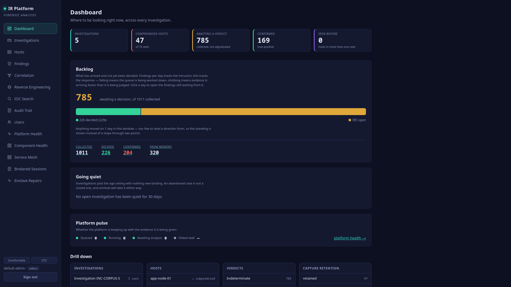

Below the trend, corpus-wide statistics with selectable facet panels — investigations,
hosts, verdicts, capture retention. Selections compose: choosing two hosts and one verdict
narrows to their intersection, and the summary beneath recomputes from the database rather
than filtering what is already on screen.

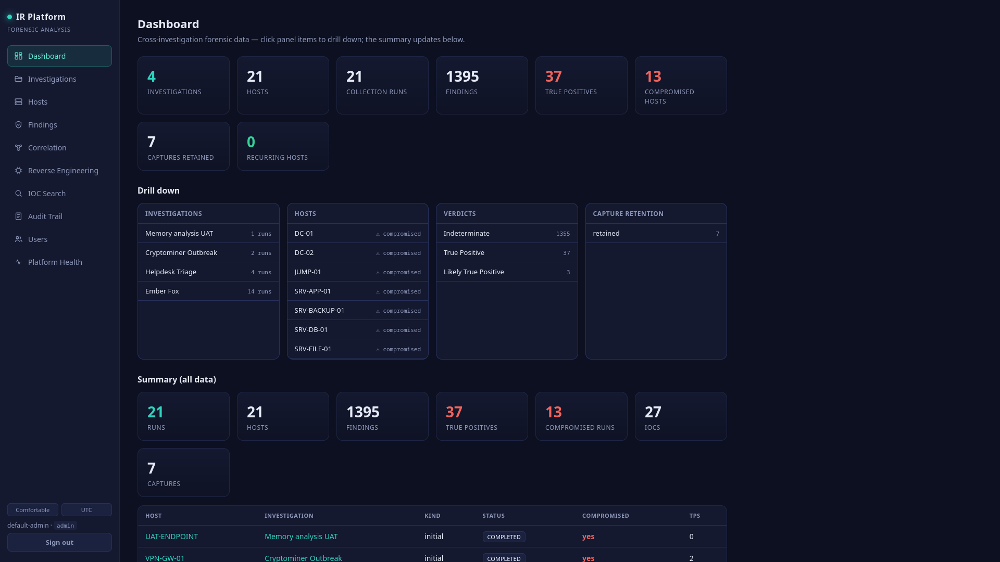

---

## Findings

Adjudicated findings across all investigations. Search, filters, ordering and paging are
applied by the database, so the view stays responsive when a run carries thousands of
findings rather than the seeded scenario's ninety-eight.

**Type against verdict.** The page opens on a heatmap of finding type against verdict — one
hue per verdict family, darkness carrying the count, with the Indeterminate column (where
the backlog actually sits) in the warning hue. Cells are filters, not links: clicking one
narrows the table below to exactly that type-and-verdict pair, clicking again removes it,
and cells combine — the selection is the sum of exact pairs, never the cross product of the
rows and columns touched.

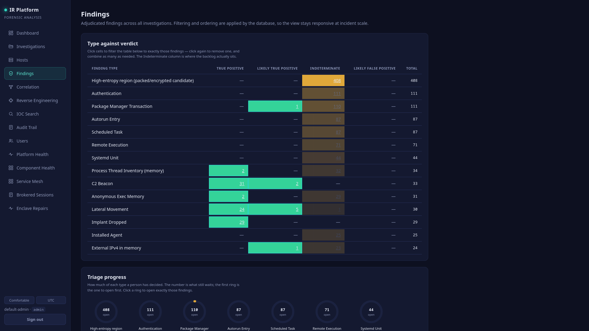

**Triage progress.** One ring per finding type: the arc is the share a person has decided,
the number in the middle is what still waits, and the rings are ordered so the first one is
the one to open next. Every active filter — selected cells and any filter a chart drill
arrived with — appears as a chip above the table with its own remove control, beside a
single **Clear filters** that returns the full table. The selection lives in the URL, so a
composed working set can be bookmarked or handed to another analyst mid-triage.

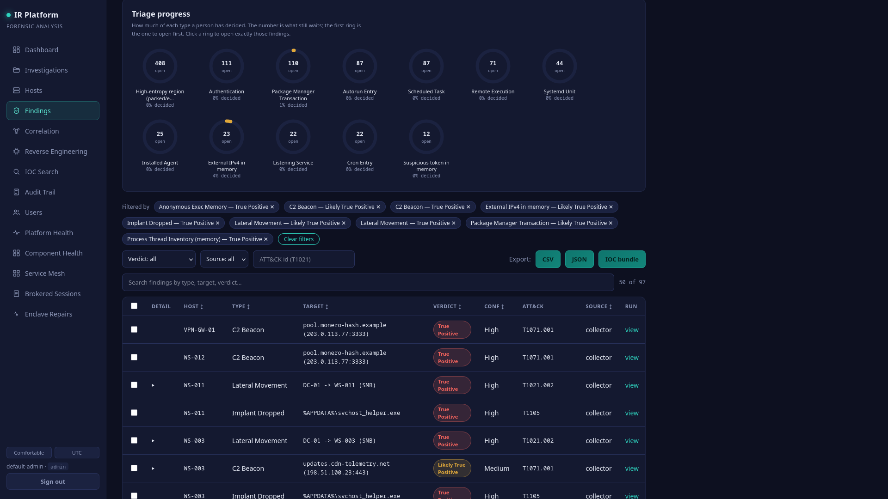

Each finding carries its host, so a row read outside its run still says where it came from.
Columns sort on click; the verdict, source and ATT&CK filters narrow server-side; and the
current filter set is preserved in the URL, so a view can be bookmarked or handed to
another analyst.

**Recovered evidence, in the row.** A finding whose analysis recovered identifying material
carries a disclosure arrow in the DETAIL column. Expanding it shows what was actually pulled
out of memory — never a re-statement of the columns already on screen.

Above, a C2 beacon on DC-02 yields the family, the implant's user-agent, its mutex and named
pipe, the JA3 and certificate it presented, the registry key it persisted under, the YARA
rule that matched, and the C2 configuration a parser extracted: address, port, sleep interval
and campaign id. That is the material an analyst pivots on, and before this panel existed it
was reachable only by reading the raw JSON.

The panel is shaped by what the finding is, not by a fixed template:

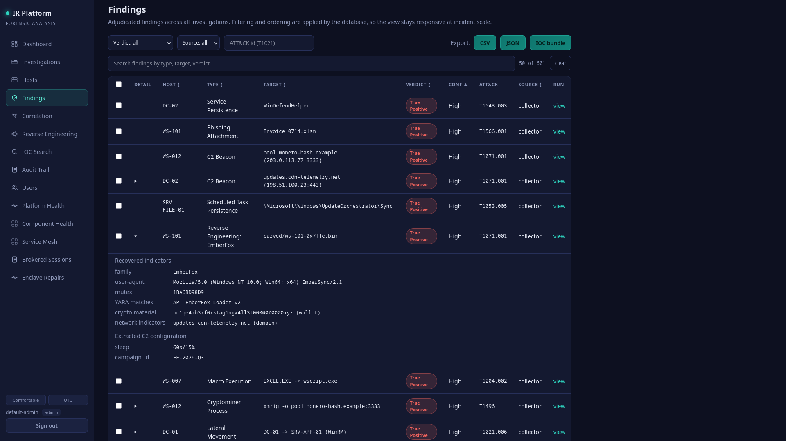

A reverse-engineering finding on a carved region adds the crypto material and network
infrastructure recovered from the binary itself. A cryptominer process adds its pool domain,
address, onion endpoint and wallets:

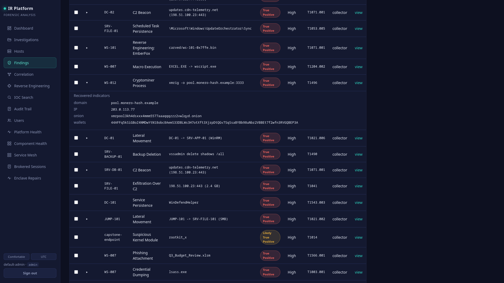

**The arrow discriminates.** Rows carrying nothing recoverable — structural memory findings,
a phishing attachment, a backup deletion — offer no expander at all, so its presence is a
signal rather than decoration.

**Bulk adjudication.** Select findings, apply one verdict, and record the reason. Each
finding's prior verdict is written to the audit ledger *and* to its own reclassification
history, so a bulk action stays as reconstructable afterwards as a single one. A verdict set
this way belongs to the analyst: a later automated pass records where it disagrees rather
than overwriting it.

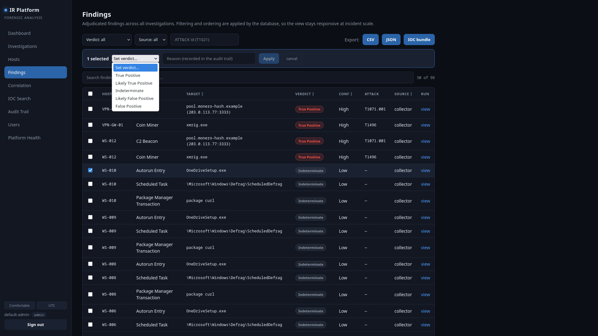

**Export.** CSV, JSON, or an IOC bundle. Every export is audited — actor, format, filters
and row count. See *Evidence export* in [`README.md`](README.md) for why export is bounded
and recorded rather than prevented.

---

## Investigations and run detail

An investigation groups the hosts collected during one engagement. It opens on the shape of
the intrusion: the headline tiles (findings, confirmed, indeterminate, hosts affected,
implicated-but-never-collected), then the kill chain as a chord diagram — every host on one
half of the ring, every attack stage it reached on the other, ribbon width carrying how
much of the evidence that pairing holds, stage color running cool-to-hot as the intrusion
progresses. Hovering an arc isolates it; clicking a ribbon opens the findings behind it.
The unmapped share is drawn rather than hidden, so evidence without an ATT&CK technique
still weighs on the picture.

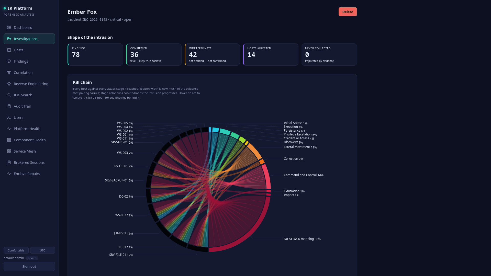

Opening a run shows what the collector found on that host, the memory capture taken from
it, and the server-side analysis of that capture.

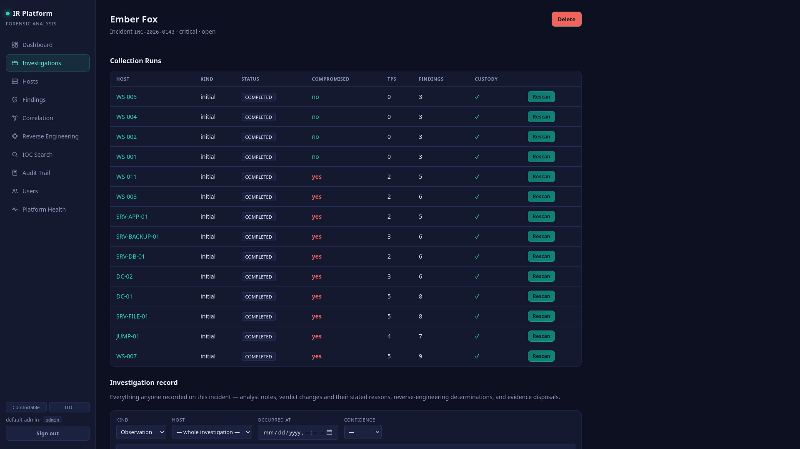

### Investigation record

Every annotation on the incident in one chronological view: analyst entries, verdict
changes with their stated reasons, reverse-engineering determinations, and evidence
disposals. Entries are contributed from different screens and different roles — the reverse
engineer works on an isolated workstation — and land in the same record.

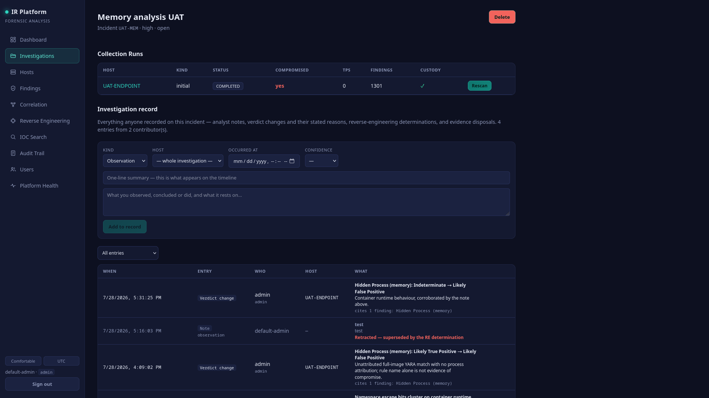

An entry carries a kind (observation, analysis, decision, action, containment, eradication,
handoff, request), a one-line summary for the timeline, the host it concerns, a confidence,
and the findings it rests on. `Occurred at` records when the event happened, separately from
when it was written down: a timeline built from record-creation times describes the
responders rather than the intrusion.

Entries are append-only. A retracted entry stays visible with the reason given, as in the
screenshot above — a record that can be rewritten after the fact is not a record.

### Adjudication

The first section on a run. The investigation engine judges **processes**, not individual
findings, and reports how many it judged into each verdict.

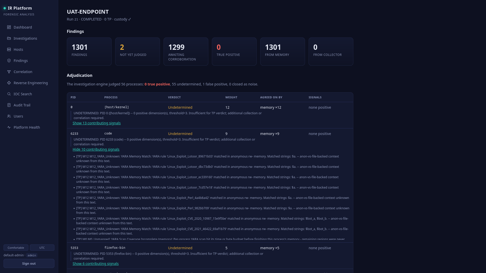

Each process row carries its verdict, the weight behind it, which detection sources agreed
and how many times, and how many dimensions fired positive. The engine's reasoning appears
on a full-width row beneath: the conclusion is always shown, and the contributing signals
expand behind a count — an unattributed full-image YARA sweep contributes over a thousand.

The findings summary above distinguishes two states that both read as Indeterminate: **not
yet judged**, where nothing has looked at them, and **awaiting corroboration**, where the
engine judged them and could not conclude on the capture alone.

**Enrichment findings.** The mwcp parser pass reads carved regions and recovers implant
configuration — C2 endpoints, exfiltration channels, ransomware indicators — which appear
alongside the plugin and YARA findings.

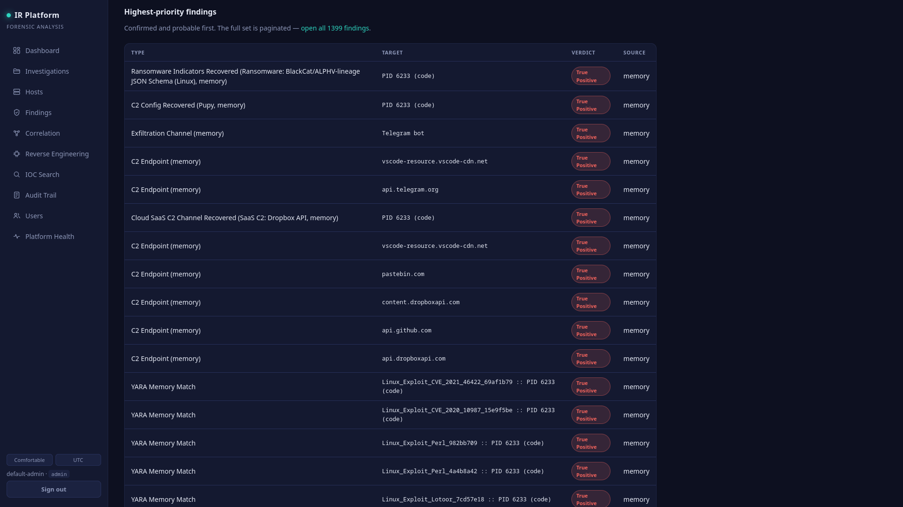

A verdict here is the engine's judgement of the *process*, applied to every finding
attributed to it. That is the intent — a finding belonging to a process judged a true
positive is a true positive — and it is also where the platform is most capable of being
confidently wrong: a recovered "C2 endpoint" is a string found in memory, and a process
that legitimately contacts many hosts produces many such strings. The rule that recovered
it, and the memory it came from, are what an analyst checks before acting.

### Attack chains

Lineage reconstructed across the findings — the sequence rather than the individual hits.

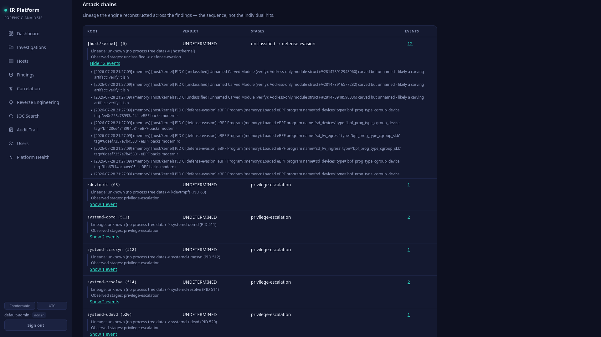

Each chain states its root process, verdict, and the stages observed. Events expand in place
or open in full from the count.

The run view also puts adjudicated findings next to the evidence that supports them — ATT&CK
technique, confidence, source, and the collector record itself.

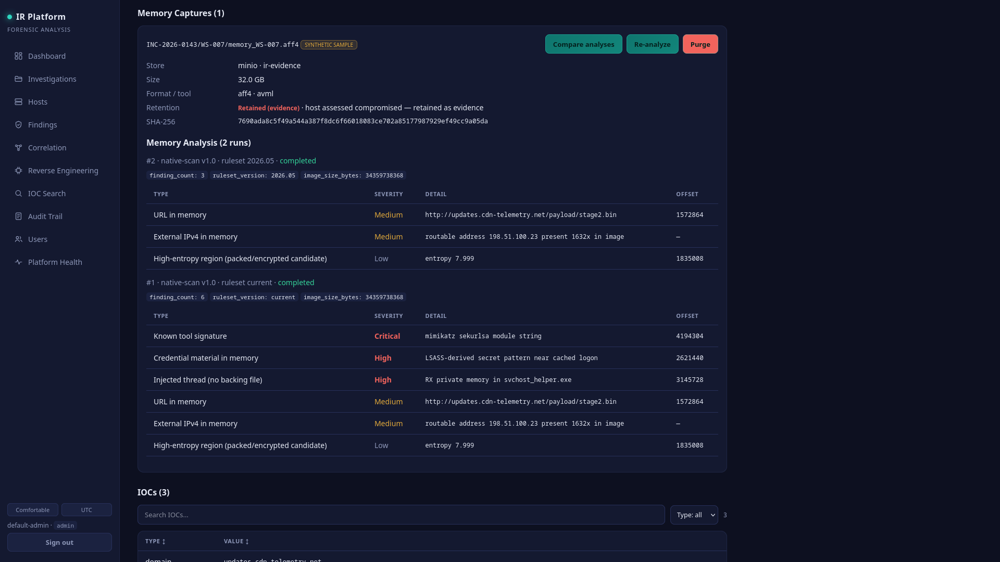

**The host's IOC index.** Everything identifying that the run recovered, rolled up per host
and typed, below the findings and the carved regions.

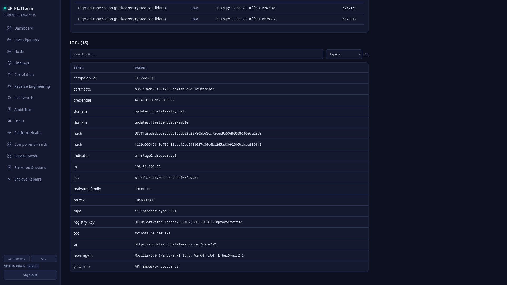

This is the rollup of what the evidence panels show row by row. It matters because the pivot
an analyst actually performs is "where else in the estate does this appear" — and that
question is asked against a typed index, not against prose inside a finding. Attribution
(`malware_family`), the matched rule (`yara_rule`), the campaign id, the implant's mutex,
pipe, JA3, user-agent and registry key all land here beside the addresses and hashes, so a
pivot on tradecraft works even after every address has rotated.

Values recovered more than once are deduplicated within a run, and anything that identifies
nothing is deliberately absent — a beacon's sleep interval is configuration, not an
indicator, and indexing it would return every host running that family.

**Memory capture and retention.** The capture is held in object storage and referenced from
PostgreSQL — never stored in the database. Its size, format, tool, SHA-256 and retention
disposition are shown together, and the disposition states its reason ("host assessed
compromised — retained as evidence") rather than a bare status.

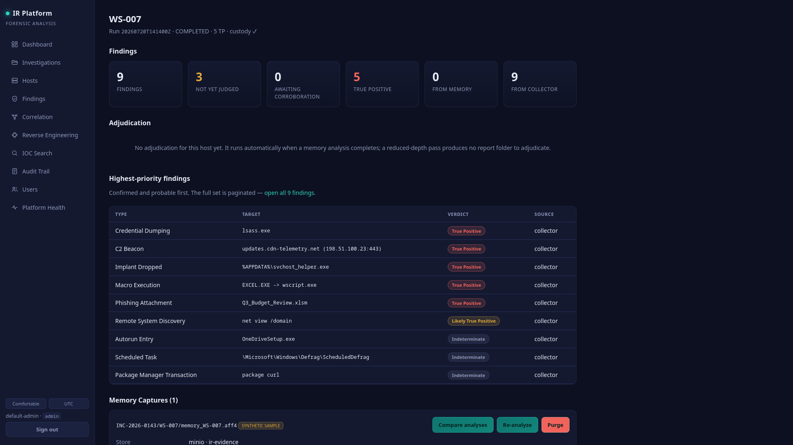

Synthetic samples are labelled as such and never presented as real captures.

---

### Shape of the intrusion (investigation detail)

Three charts above the runs table, each rendering a server aggregate and each mark drilling
to the filtered table behind it by a URL the table already accepts:

- **Kill-chain lanes** — one mark per technique x day x host, labeled `confirmed/total` and
  dashed when nothing is confirmed, so verdict stays a dimension rather than a silent
  filter. A mark opens the findings behind it.
- **Blast-radius ring** — hosts placed by first-observed order, sized by findings, banded by
  campaign-membership confidence (color AND stroke pattern, so the band survives monochrome
  reading). A mark opens the host through the host table's own search.
- **Coverage bar** — collected hosts against hosts the evidence implicates but nobody
  collected, the latter hatched. The uncollected segment expands its own list in place:
  those hosts have no rows for any table to filter, and the chart says so instead of
  pretending a filter exists. The most expensive mistake in an IR is concluding on hosts
  nobody looked at, which is why this chart is allowed to be uncomfortable.

## Correlation

The multi-host picture, derived from collected evidence and held in a separate store from
the evidence itself. The header states when it was computed and by which algorithm version:
a correlated conclusion is never presented as if it were collected fact.

An investigation can hold more than one intrusion, so the campaign is selected separately
from the case. Each is named from its own evidence — the attributed family and its patient
zero — rather than from the case it sits in.

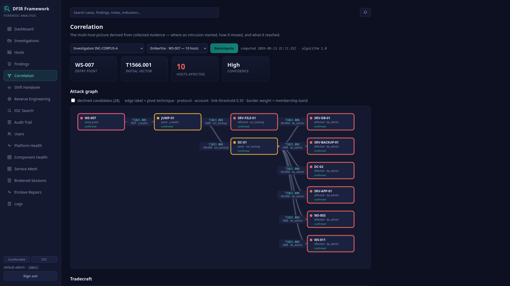

- **Entry point and initial vector** — the host the intrusion entered through and the
  technique it entered by, identified from evidence rather than from timing alone.
- **Attack graph** — hosts laid out by how many moves they sit from the entry point, each
  edge carrying the protocol and the account used. Roles are named: entry point, pivot,
  affected.
- **What carries a link** — selecting an edge shows its stored corroboration rows as bars,
  strongest first: a link riding one shared address dies when the actor rotates, and one
  riding mutex + JA3 + campaign id does not. Each bar searches its value everywhere.
- **Rarity scatter** — every shared indicator plotted host-count against the engine's own
  rarity-adjusted linkage weight, so signal and environment separate visually; a dot opens
  the IOC search already filtered to it.
- **Cohesion strip** — mean within-campaign cohesion per correlation run, oldest first, the
  current run marked: whether the campaign tightens or fragments as evidence lands. Every
  recompute supersedes rather than mutates, which is why the history exists to draw.
- **Membership band** — the border weight on every node. `confirmed`, `probable`, `possible`
  or `indeterminate`, and each one decomposes into the link, the evidence kinds and the
  timing that produced it. `indeterminate` means the question was not answerable, not that
  the evidence was weak.
- **Declined candidates** — pairs the engine considered and refused, with the reason. A link
  that was declined is as informative as one that was accepted, and an analyst asking "why
  aren't these two the same intrusion?" gets an answer rather than an absence.
- **Link threshold** — stated on the page, because a merge nobody can see the bar for is not
  a merge anybody can defend.

### Tradecraft

What an actor carries between engagements, computed from behavior rather than indicators.
Infrastructure is what they rotate; habits are what they keep.

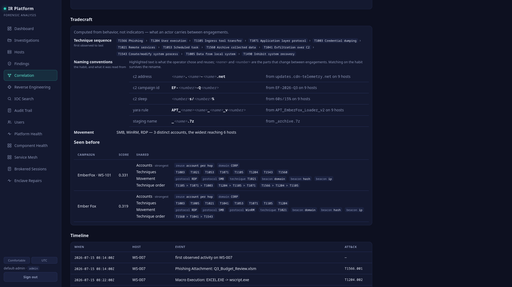

- **Technique sequence** — ordered by when each technique was first observed, from the
  finding that carried it. Ordinary fleet activity cannot set that order.
- **Naming conventions** — the *shape* of a name, not the name. Highlighted text is what the
  operator chose and reuses; `<name>` and `<number>` are the parts that change between
  engagements, so a match survives a rename. Every shape is shown beside the collected value
  it was read from and the number of hosts carrying it — an abstraction a reader cannot
  trace back to evidence is indistinguishable from a placeholder.
- **Seen before** — other campaigns scoring above the similarity floor, with the shared
  components named and the strongest marked. Advisory: nothing here is written onto the case.

Only evidence confined to the campaign and adjudicated as compromise can become tradecraft.
Software present across the fleet describes the environment, not an operator, however
distinctive its name looks.

### When there is not enough to say

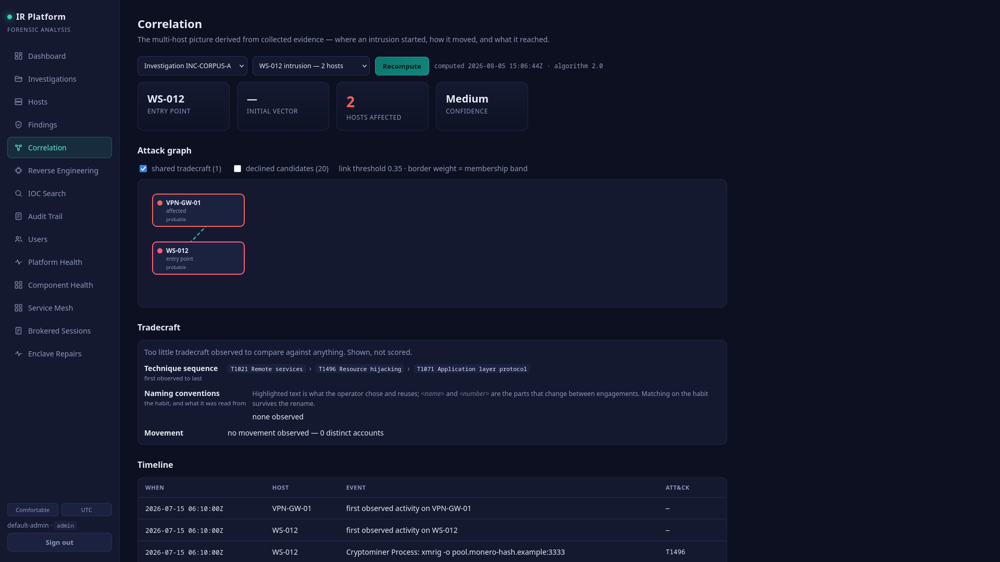

The same investigation's second intrusion — a commodity cryptominer on two hosts. It has
three techniques, no naming conventions and no observed movement, so the platform states
plainly that there is *too little tradecraft to compare against anything* and declines to
score it.

That refusal is the point. A similarity computed from three common techniques is a
coincidence with a number on it, and ranking it beside a real match is how a heuristic turns
into a false accusation.

### Shared indicators

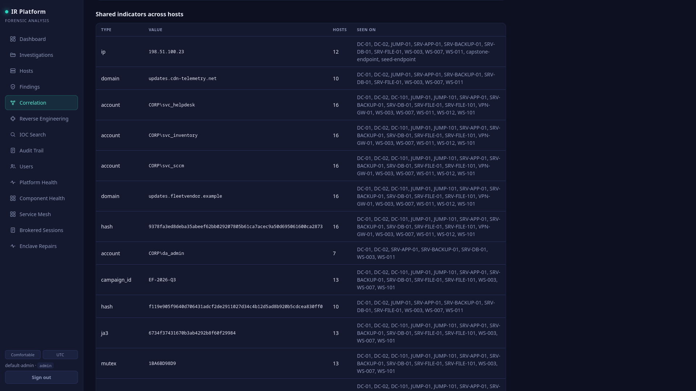

Indicators and accounts seen on more than one host, each listed with every host carrying it.
Sharing alone does not merge anything: a service account present on the whole fleet is
weighted as the environment it is, which is why two unrelated compromises in one engagement
stay two campaigns.

Correlation is recomputed on demand and supersedes rather than overwrites, so an earlier
conclusion remains readable and explainable.

---

## Reverse engineering

The queue of carved memory regions, visible to `reverse_engineer` and `admin`. Regions
appear once a capture has been analyzed with symbols: carving happens in the per-process
YARA pass, and regions are uploaded to a bucket per host.

Rows carry the host, the region, its size, the rule that carved it, the PID and process it
was attributed to, and its triage state — unanalyzed, in progress, analyzed, benign. A
region is claimed before it is worked.

**Why a region was carved.** Opening a region states the signature hits that flagged it
before asking for a verdict.

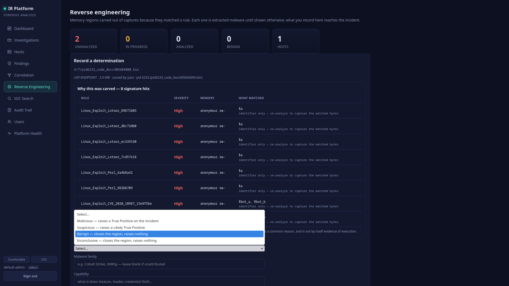

Each hit carries the rule, its severity, the memory it matched in, and what actually
matched — the string identifier, its offset, and an excerpt of the bytes. The identifier
alone is not reviewable: `$a` names a slot in the rule, not the content, and cannot
distinguish a real C2 string from a rule matching its own source text quoted in a buffer.

Memory permissions carry as much weight as the rule name. A hit in anonymous `rw-` memory
matched **data**; the same rule on anonymous `rwx` matched code that nothing on disk
accounts for. When every hit landed in non-executable memory the panel says so, because
that fact usually settles whether a region is worth pursuing.

Regions are not opened here. The workstation that opens them has no network namespace, so
they are staged to it first by a mediator with object-store access; see
[`WORKFLOW-RE.md`](platform/WORKFLOW-RE.md).

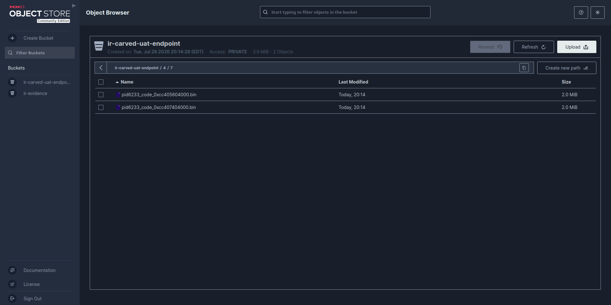

Regions live in `ir-carved-<hostname>`, held apart from the evidence bucket so a session can
be granted exactly one host's regions and see no other case.

**The session.** Binary Ninja opens the staged regions with no network, all capabilities
dropped, and the mount read-only.

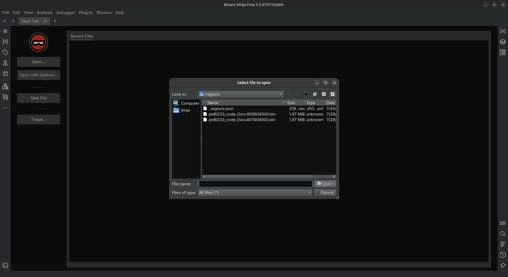

The session sees one host's regions and the manifest that names their object keys — no
credentials, no route to the store, and nothing writable.

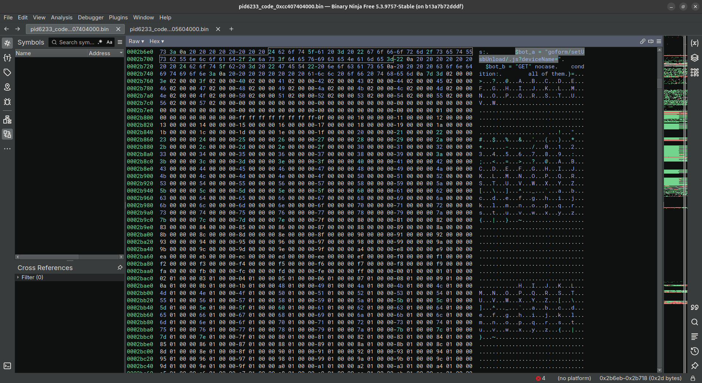

The hex view is where a signature hit is confirmed or dismissed. In the region above the
matched bytes are the text of the YARA rule itself — `$bot_a = "goform/…"` — sitting in an
editor's heap: the rule matched its own definition.

**Ghidra as the alternative.** The tool is chosen per deployment with `IR_RE_TOOL`; the
session's boundary is identical either way — no network, all capabilities dropped, regions
mounted read-only. Ghidra additionally needs somewhere to write a project, so it gets a tmpfs
that is destroyed with the container rather than a writable mount.

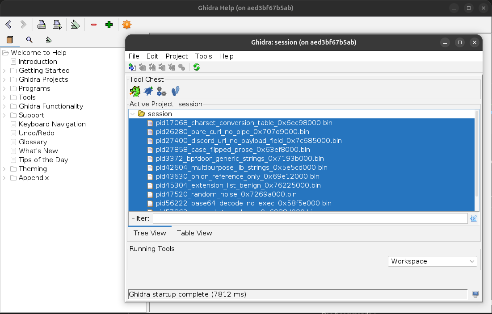

Every region is imported before the window opens. An analyst handed an empty project manager
and a read-only mount has to import twelve files by hand, at the right base address, before any
work starts — so the session does it and opens the project already populated.

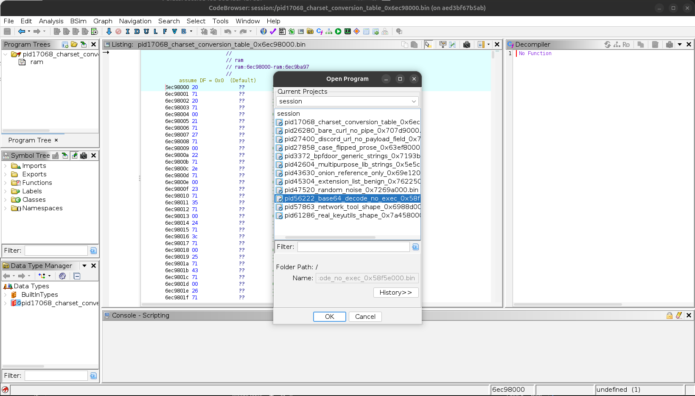

The listing begins at `6ec98000`, not at zero, and the region occupies `ram:6ec98000` to
`ram:6ec9ba97`. This is the reason the carve filename carries `_0x<vm_start>`: a carved region
is raw memory with no header, no entry point and nothing a loader can recognize, so it is
imported with `-loader BinaryLoader -loader-baseAddr` set from the name. Loaded at zero, every
pointer inside the region resolves to a file offset and nothing cross-references; loaded at its
real base, the pointers resolve to each other.

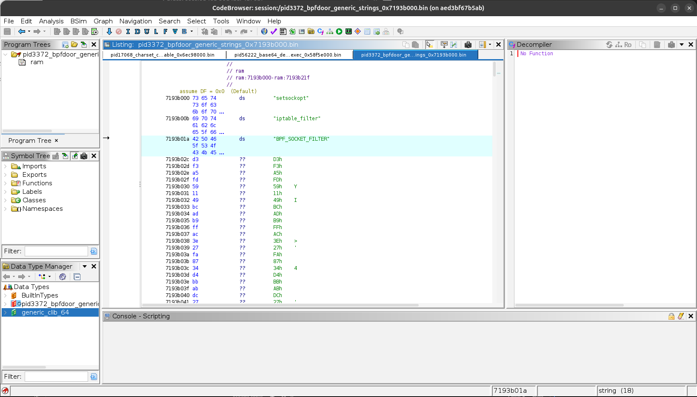

The same mechanism on a region whose contents are legible: `setsockopt`, `iptable_filter` and
`BPF_SOCKET_FILTER` at `7193b01a`, with auto-analysis having applied the C library type
archive. Those three strings together describe a socket filter installed on a raw socket —
the shape of a passive backdoor — which is exactly the judgement the RE role exists to make
and record.

**Recording a determination.** A verdict of malicious or suspicious requires a written
statement, a capability, and corroborating evidence; `definitive` confidence additionally
requires a malware family and file characteristics. The form carries fields for strings of
interest, YARA matches, network indicators, crypto material, extracted configuration,
related hashes and MITRE techniques.

A malicious or suspicious determination raises a Finding on the owning run, so the analyst
sees the conclusion without opening the region, and the determination appears in that
investigation's record.

**Purging a benign region.** A region assessed benign can be purged from object storage — a
reason and a full statement are required, and the region's SHA-256 is captured first. The
row and its analyses remain: what a region was determined to be stays part of the
investigation after the sample is gone.

---

## IOC search

Cross-investigation indicator lookup — the "have we seen this before?" question, asked
across the whole corpus rather than one case.

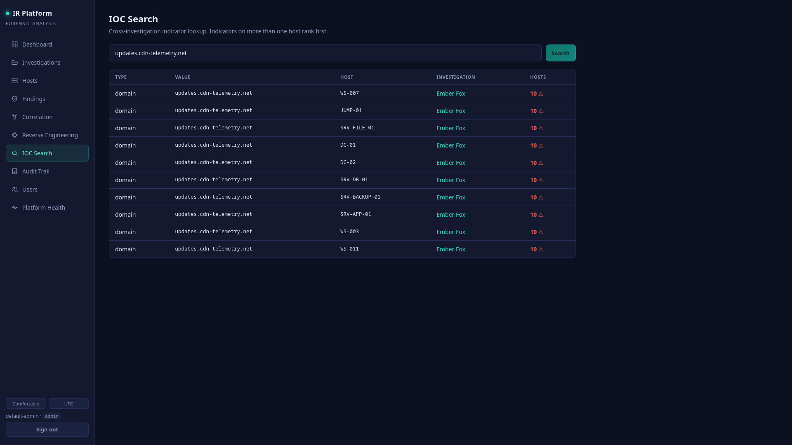

---

## Audit trail

Every mutation and privileged action, append-only and hash-chained. The chain is verified
over the **whole ledger** on load, not just the page being viewed, so tampering outside the
visible window is still detected. Visible to auditors and administrators.

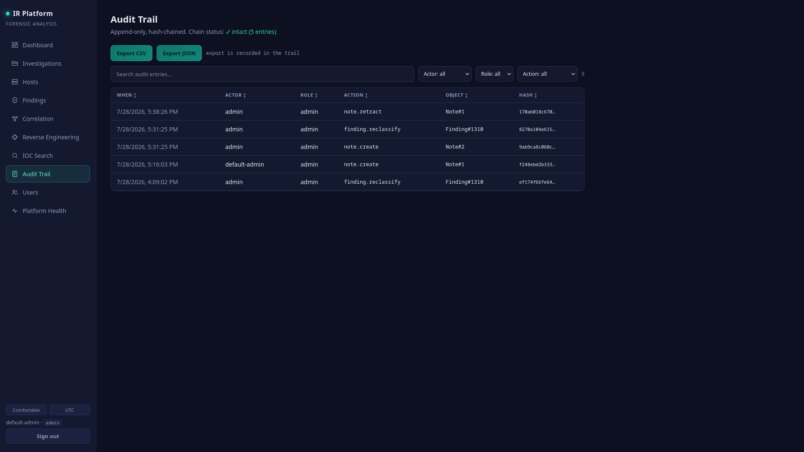

**Export.** CSV or JSON, honoring the active filters and an optional date range. Each entry
carries its `hash` and `prev_hash`, so the chain can be verified independently of the
platform. The JSON form states whether the chain is intact and where it first breaks; the
CSV form carries the same in its response headers. Taking an export is itself recorded in
the trail before the file is sent.

---

## User management (admin)

Accounts are created here and provisioned into Keycloak in the group matching their role.
New users receive a temporary password and are required to change it at first sign-in.

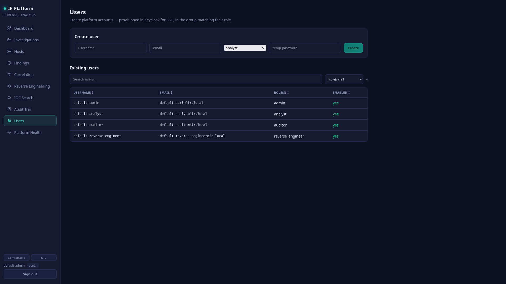

---

## Platform health (admin)

Whether the platform itself is healthy, separate from what it has found. Measured on each
refresh and never cached — a stale health panel can report healthy while the thing it
describes is down.

**Components** — live probes to every service with per-hop latency. A service answering
401/403 counts as healthy: refusing an unauthenticated probe is correct behavior, not an
outage.

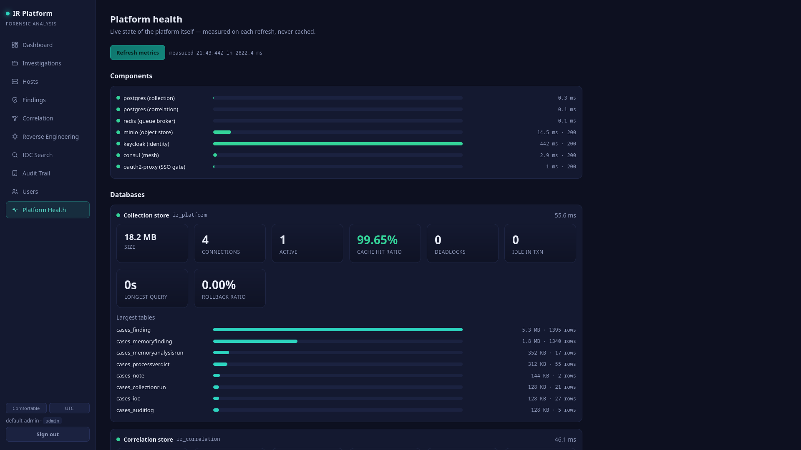

**Databases** — the collection store and the derived correlation store are reported
separately, because they have different shapes and different failure modes. Size,
connections, active queries, cache hit ratio, deadlocks, idle-in-transaction, longest
query, rollback ratio, and the largest tables by size and row count.

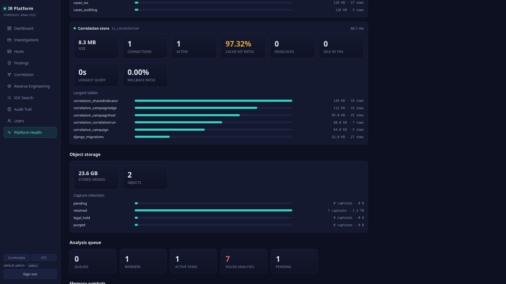

**Object storage, queue and audit integrity** — bytes and object counts, what retention is
holding broken out by disposition, analysis backlog and worker liveness, and whether the
audit hash chain still verifies.

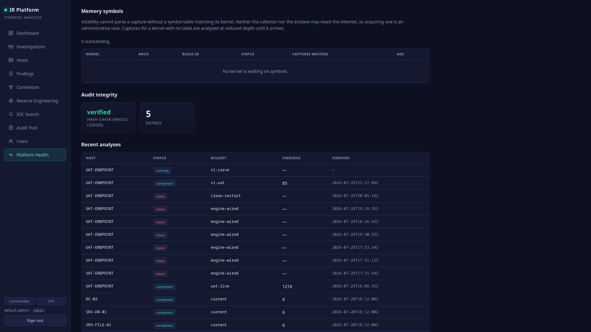

Probes run inside the enclave against live services. Host-level diagnostics
(`platform/troubleshooting/diagnose.sh`) stay an operator tool run on the host — reaching them from
the web tier would require the container runtime socket, which the segmentation model does
not permit.

---

## Component health (admin)

Platform health answers whether each service is reachable, which is what gets asked once
something has already broken. This answers the question worth asking first: a memory image is
the size of the endpoint's RAM, so what matters is not how full a volume is but whether what
is coming will fit on it.

Every figure is reported by the component it describes. A container's real limits are only
visible from inside it — the cgroup ceiling is not the host's RAM, and one component's
filesystem is not another's. The DMZ receiver has no route inward, so its report reaches the
platform the way its bundles do: carried outbound by the puller.

**What to act on** — each alert names the component, the shortfall, and the volume to expand.
A warning that only says something is too small leaves an admin to go and find out which,
which is the delay this page exists to remove.

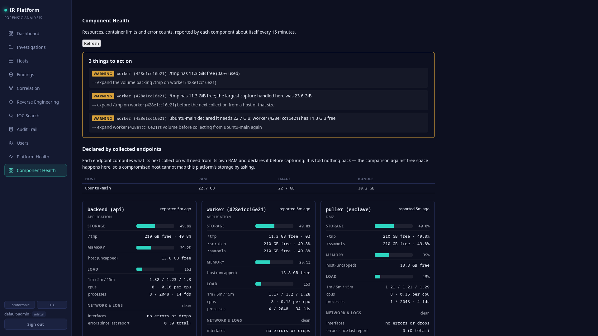

**Declared by collected endpoints** — each endpoint computes what its next collection will
need from its own RAM and declares it *before* capturing. It is told nothing back. Asking the
platform whether there is room would hand a potentially compromised host a map of the
enclave's storage, which is the one thing the one-way boundary exists to prevent; the
comparison happens inside, where the free space is known.

**Per component** — storage per volume with free space, the container memory ceiling (or the
host figure where no limit is set), load against available CPUs, processes and file
descriptors against their limits, interface errors and drops, and errors counted in-process
since the last report. Counting in-process rather than reading a container log stream keeps
the figure exact and the runtime socket out of the web tier.

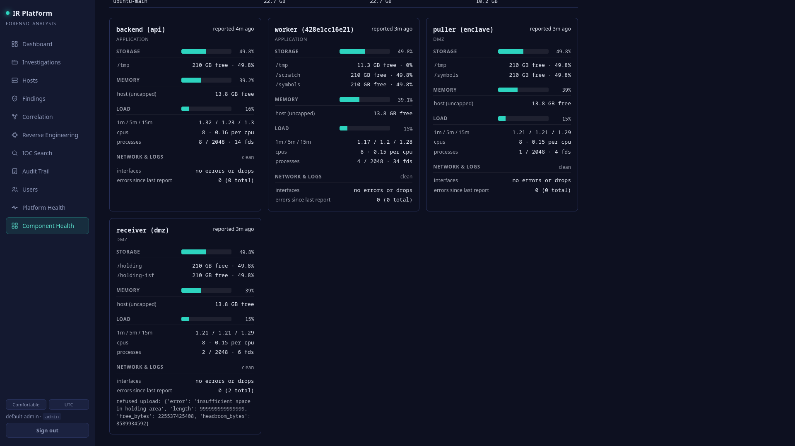

Reports arrive every 15 minutes, so an admin's warning time is the gap between two of them.
That makes a reporter that has gone quiet as important to show as one reporting a problem: a
stale row renders dashed and labelled rather than dropping off. Workers are keyed by container
and pruned once they have missed enough intervals to be gone rather than busy; the backend,
puller and receiver are named for their role and kept however old they get, because one of
those going silent *is* the incident.

---

## Service mesh (admin)

What is in the mesh, and what it authorizes — deliberately one page, because answering only
the first is how a mesh looks healthy while enforcing nothing.

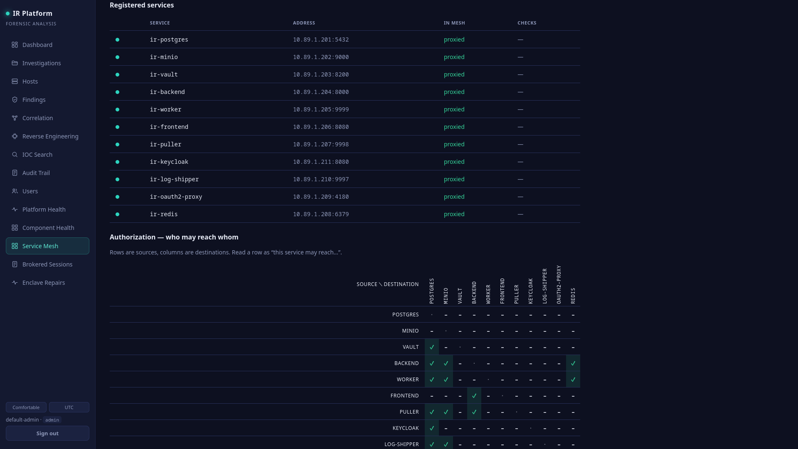

**Registered services** — the Consul catalog, with whether each service has a live Connect
proxy in front of it. A service registered *without* a sidecar is the dangerous state: it is
up, it looks fine, and its traffic bypasses every intention — so it is called out in a banner
rather than left for someone to notice in a table.

**Authorization matrix** — rows are sources, columns are destinations; read a row as "this
service may reach…". An explicit allow, an explicit deny, and "no rule — the destination's
default-deny applies" render differently: the outcome of the last two is the same, the reason
is not, and only one survives someone adding a rule above it.

The page reads Consul live over TLS with a read-only token, so the matrix is the policy as
Consul **enforces** it, not as the repository's files describe it — the two can differ, and
when they do, this is the half that decides every connection. "Cannot reach Consul" renders
as its own error state, never as an empty mesh.

---

## Brokered sessions (admin, auditor)

Analysts reach this platform only through a Boundary session, so this list is the platform's
complete access record: who connected, from where, to what, when, for how long, how much
moved, and why it ended. The application tier cannot answer any of that — the connection
terminates at the broker before a request reaches it.

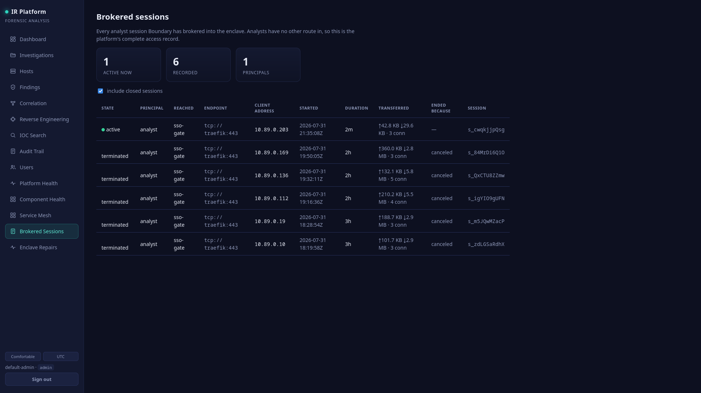

Principals and targets are resolved to names, with the raw ids kept on hover for correlation
against Boundary's own logs. Terminated sessions stay listed — an access record that keeps
only what is currently open answers the least interesting version of the question.

**Signed on** names the person. The principal beside it (`analyst-s1`…`analyst-sN`) is a pool
identity, and every connection reaches Boundary from the distributor, so Boundary's own record
cannot tell one analyst from another. The column is filled from the platform's sign-on record
instead, matched by time, and it says how strong the match is: a single overlapping sign-on is
shown as a name, several are shown as `name +N (overlapping)` with all of them on hover, and
where nothing overlaps or the session has no start time it says so. A session three analysts
could have used is never shown as one analyst's.

The page authenticates to Boundary with its own credential, which can list and read sessions
and nothing else: watching access is not a route to obtaining it, and
[`platform/test/uat_boundary.sh`](platform/test/uat_boundary.sh) proves both halves — that this page matches
the controller's own records, and that its credential is refused when it attempts a cancel.
When the broker does not answer, the page says so rather than rendering an empty table:
"nobody is connected" is the most dangerous wrong answer this screen can give.

---

## Enclave repairs (admin)

Named, pre-defined repairs for the failure modes the platform knows about — re-applying mesh
authorization policy, re-attaching orphaned sidecars, reaping stale Boundary workers,
restarting the analysis worker, rotating database credentials, unsealing Vault. Each card
states what it does, when it applies, and whether it is disruptive.

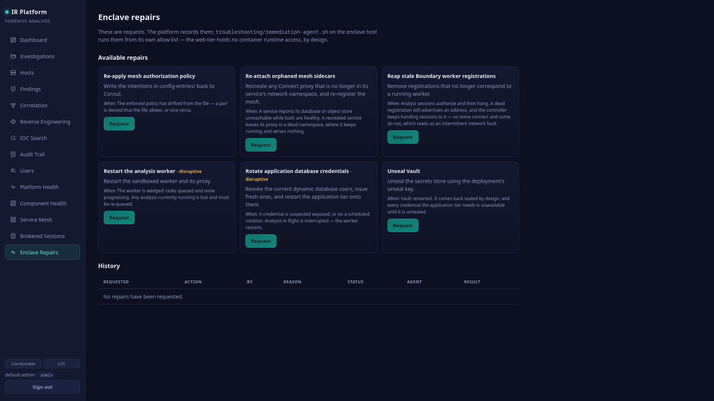

The page **requests**; it does not execute. A request is recorded with actor and reason, and
the remediation agent — an isolated executor container deployed by `deploy.sh agent`, with no
network and the runtime socket as its only authority — claims it, checks it against its own
allow-list, runs it, and writes back status, output and exit code. The web tier holds no
container runtime access — an application-tier compromise can queue a named repair and
nothing else. The history keeps every request with what the agent did about it.

**The whole catalogue, run and recorded.** Each repair below was requested from this page and
executed by the agent; the history row carries the operator output that proves what happened,
not just a green word.

**Re-apply mesh authorization policy** — every service token verified present, every
`config-entries/` file written back to Consul, ending in `ACL bootstrap complete`. The output
reads the same whether the policy had drifted or not, because the action converges rather than
diffs.

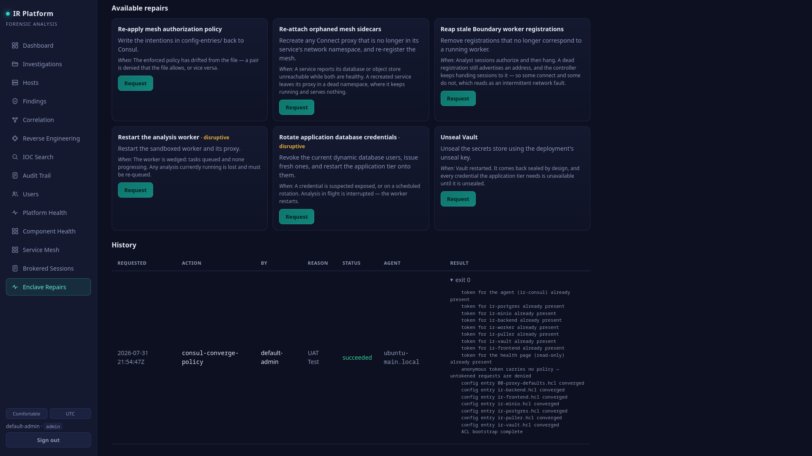

**Re-attach orphaned mesh sidecars** — the heaviest repair: a full staged enclave deploy runs
inside the agent, and the recorded output is the deploy's own gate-by-gate transcript, through
`enclave up`. The Boundary controller is recreated along the way; the session broker
re-establishes itself, and the transcript says so.

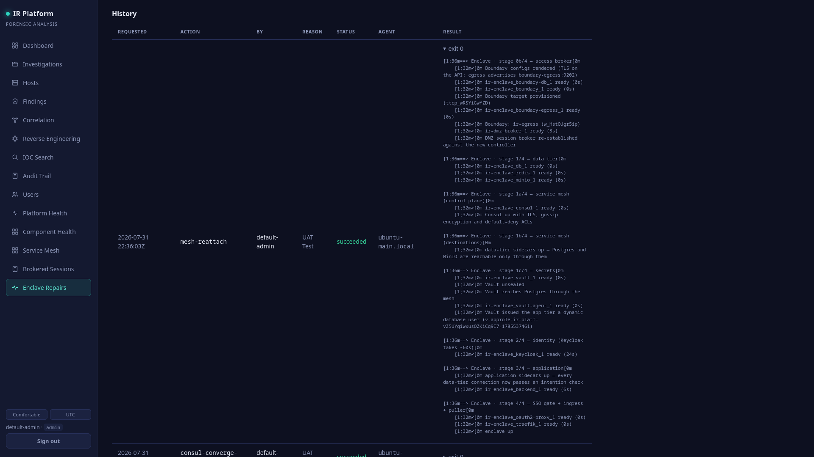

**Reap stale Boundary worker registrations** — the output is the surviving registry: one
worker, the enclave egress. Anything else was a dead row still being handed sessions.

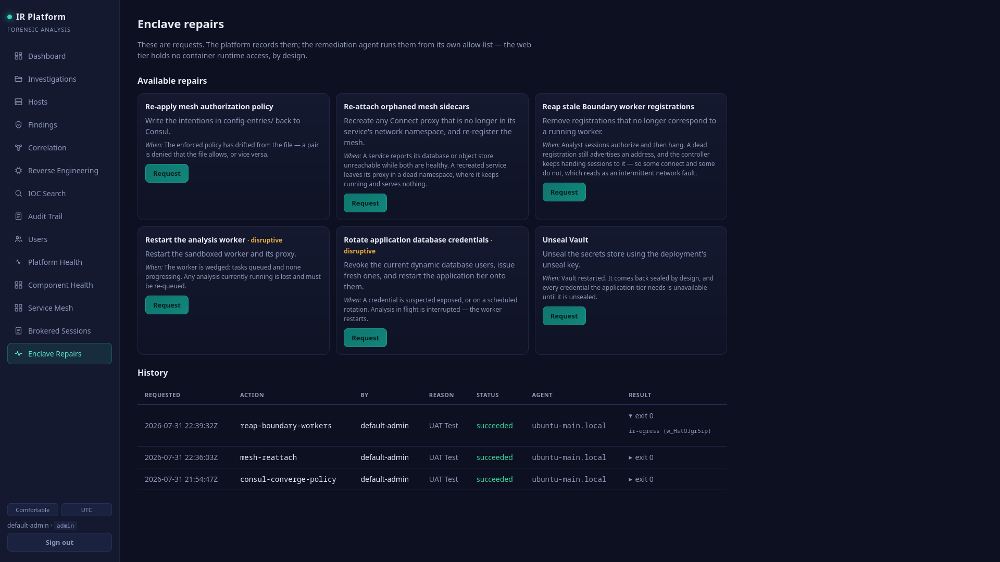

**Restart the analysis worker** — the worker first, then its proxy, in that order, because a
restarted service gets a fresh network namespace and a proxy restarted first would be left in
the dead one.

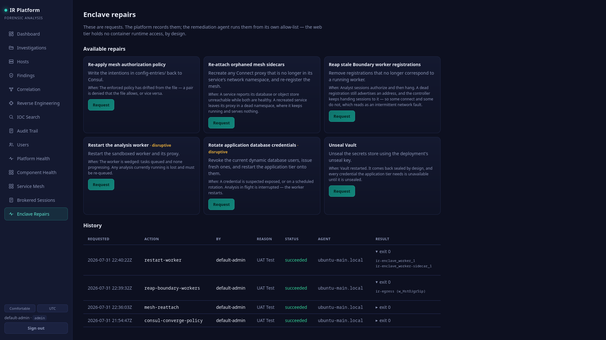

**Rotate application database credentials** — the full rotation narrative: a temporary root
minted through break-glass, every lease under the application role revoked, fresh dynamic
users issued, the temporary root revoked, and the application tier restarted onto the new
credential — ending `platform healthy`.

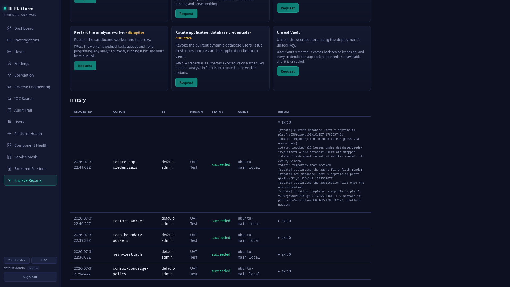

**Unseal Vault** — run against an already-unsealed Vault it reports exactly that and exits 0.
A repair that is not needed saying "nothing to do" is the honest outcome, not a failure.

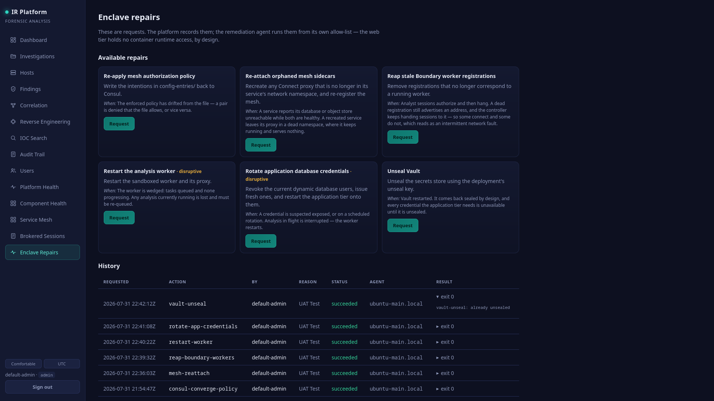

---

## Evidence storage

Raw captures live in a private object-storage bucket keyed by incident and host.
PostgreSQL holds metadata, hashes, analysis results and a pointer to the object. That
separation is what makes the retention lifecycle possible: a capture can be purged while
its analysis results and custody record remain.

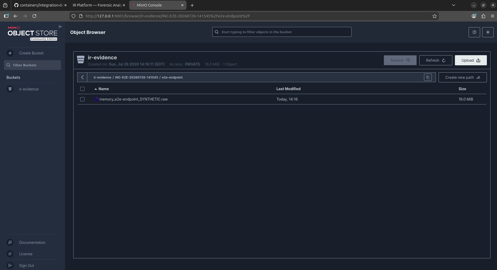

The object store is not published; it is reachable only while an administrator has opened
a management forwarder (see [`platform/admin/`](platform/admin)).

---

## Display preferences

Density (comfortable or compact) and time zone (UTC or local) are per-workstation
preferences, persisted locally. Every timestamp is rendered with its zone label —
ambiguous times are dangerous when correlating activity across hosts.
