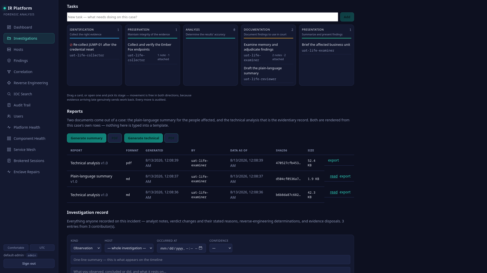
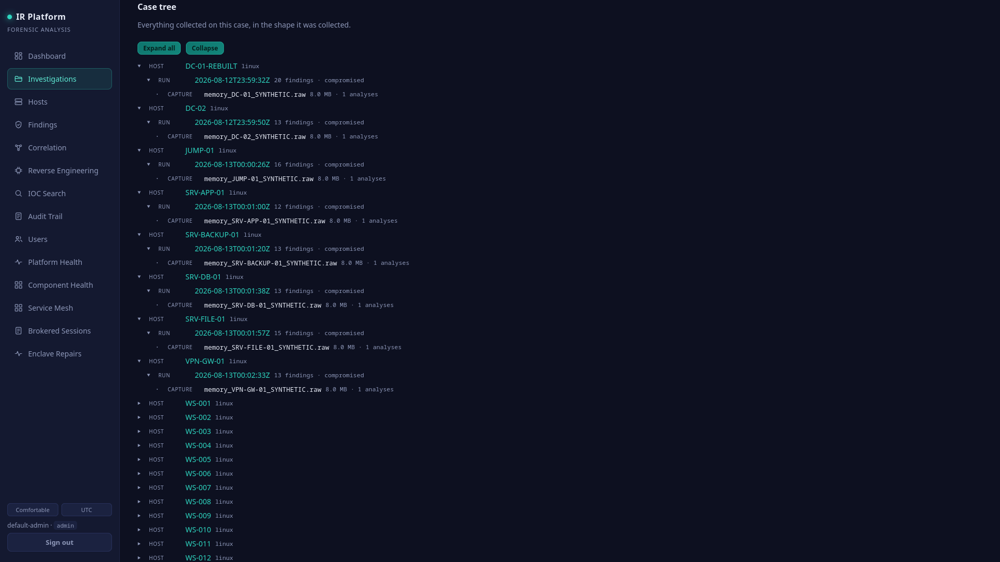
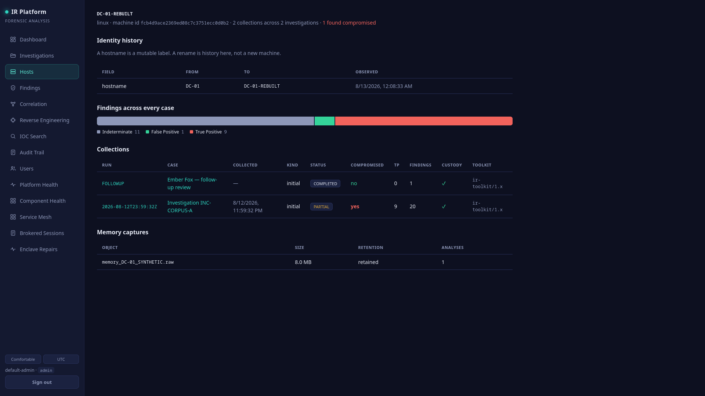
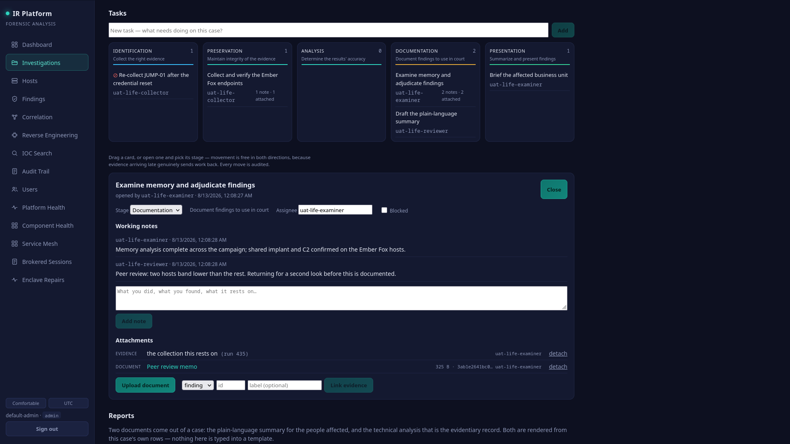
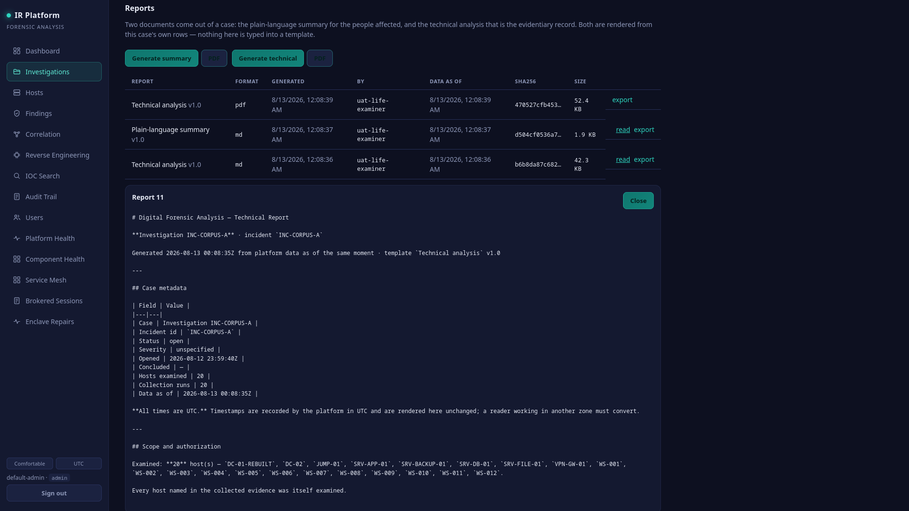

# Working an investigation, collection to report

The whole path through the DFIR Framework, in the order it actually happens. Every step
below is exercised by `test/uat_lifecycle.sh`, which runs this same lifecycle against real
collections and checks the resulting report against the tables it was drawn from — so this
document describes what the framework does, not what it is meant to do.

**▶ [Watch the walkthrough](img/concept_demo_alpha.mp4)** — the same path, on screen.

The five stages are the digital forensics process, and they are the columns of the case
board: **Identification → Preservation → Analysis → Documentation → Presentation**.

> **Movement is free in both directions.** Evidence arriving late genuinely sends work back
> to Analysis. A board that only advanced would record that as progress.

---

## 1. Identification — collect the right evidence

**Where:** the endpoint, then *Investigations → the case → Case tree*.

The collector runs on the suspect machine with no network namespace, writes its evidence to
a local folder, and seals it there. The seal is computed at the point of collection, not on
arrival, which is what makes the rest of the chain meaningful.

```bash
sudo ./collector/respond.sh --incident INC-2026-0001 --hmac-key "<the platform's key>"
```

Bundles ship to the DMZ receiver over TLS with the receiver's own certificate pinned. The
enclave never accepts a push: its puller reaches outward, drains the holding area, and
verifies each seal before anything is stored.

**What the platform records:** a `CollectionRun` per endpoint, its custody events, and the
toolkit version that produced it. **What you do here:** open a task for the collection work
and assign it to yourself.



**If a machine cannot be collected**, say so on the case rather than leaving a silence — the
report has a scope section that names every host examined *and* every host implicated but
never looked at, and that section is only as honest as this step.

---

## 2. Preservation — maintain integrity of the evidence

**Where:** *Case tree* (custody column) and *Run detail → Custody*.

Nothing to do by hand: the receiver verified the seal on arrival, the puller re-verified it
inward, and every handling event is appended to a hash-chained custody ledger. What this
stage is *for* is checking that it happened.

**Look at:** every run showing `custody ✓`. A run that does not is not a run to analyze — it
is a run to explain.



Move the collection task here once the evidence is in and verified, and record in a note
what arrived and what did not. That note is what the report's evidence inventory reads.

---

## 3. Analysis — determine the results' accuracy

**Where:** *Run detail*, *Findings*, *Correlation*, *Reverse Engineering*.

Memory analysis runs server-side in a sandbox with no egress. It produces memory findings,
adjudicated process verdicts, and carved regions for anything a rule fired on.

Then the work that only a person can do:

- **Adjudicate.** The engine proposes; you decide. An analyst verdict takes precedence over
  the engine's and the disagreement is kept — both are in the record, with who and when.
- **Correlate.** *Correlation* shows why hosts are one campaign: the weight of each link,
  the kinds of evidence carrying it, and the links the engine **considered and declined**.
  Read the declined ones. What was rejected, and on what grounds, is the difference between
  a conclusion and a coincidence.
- **Check the host.** Click any host to see it across every case — its renames, its
  collections, its verdict spread. "Have we seen this box before?" is answered there.

  
- **Send work back.** If a peer review finds a host resting on one thin indicator, drag the
  card back to Analysis and say why in a note. That is the board working, not failing.

**Blocked?** Tick *blocked* on the task and give the reason. The task stays in the stage it
stalled in — moving it to a "blocked" column would lose where the work actually stopped.

---

## 4. Documentation — document findings to use in court

**Where:** *Investigation record*, *Tasks*, and the case's **negative findings**.

Three kinds of entry matter here, and all are append-only — a mistaken entry is retracted
with a reason and stays visible:

| Entry | What it is for |
|---|---|
| **Summary** | the one-paragraph account of what happened; the plain-language report opens with it |
| **Recommendation** | what still needs doing, numbered in both reports |
| **Containment / eradication** | what was already done, and when |

**And the one most people skip: what you ruled OUT.** "We enumerated every USB device on the
affected hosts and none predates the earliest implant, so removable media was not the entry
point" is a *finding*. Record it with how it was tested and what it rests on. A report that
says only what was found invites a reader to invent their own explanation; one that says
what was looked for does not.

Attach the working material to its task — a peer-review memo, a third-party report — and
link the evidence a conclusion rests on. Documents are stored with their sha256 recorded on
receipt; evidence links point at what the platform already holds and copy nothing.



---

## 5. Presentation — summarize and present findings

**Where:** *Investigation → Reports*.

Two documents, generated from the case's own rows:

- **Plain-language summary** — for the affected party. What happened, how it started and how
  it did *not*, what was already done, what still needs to happen, and a glossary.
- **Technical analysis** — the evidentiary record: case metadata, scope (including what was
  not examined), the evidence inventory with **custody verification recomputed at render
  time**, tools and versions for reproducibility, methodology, timeline, findings per host
  with who adjudicated each, memory detail, defanged indicators, correlation, **links
  declined and why**, attribution *with its restraint*, **negative findings**, limitations,
  actions taken, recommendations, and the audit trail with its chain verification.

Both render to PDF inside the enclave with no network access — a title page carrying the
case identity and handling caveat, a table of contents, running headers and numbered pages
that state the total, so a reader can tell the document is complete.



Worked examples of both, generated from this case:
[technical analysis](img/technical-61.pdf) · [plain-language summary](img/summary-61.pdf).

Three properties worth knowing:

1. **Generating is not exporting.** Rendering a report and reading it in the browser is an
   analyst right. Taking the file out needs the export right, and lands in the export ledger
   with the report's hash. You should expect to be refused the download if you hold only
   the first.
2. **Every render is recorded** with its template version, its sha256, and the moment the
   data was read. A second render after new evidence is a different document, not an update.
3. **Indicators are defanged** — a domain renders as `example[.]invalid` rather than as a
   live link. Nothing in a report can be clicked into attacker infrastructure.

---

## 6. After the case

- **Conclude** the investigation when the work is done. The lifecycle state machine refuses
  moves that make no sense and records the ones it allows.
- **Archival is automatic.** A concluded case goes to cold storage after its grace period; a
  case still open past the hard ceiling is archived anyway and flagged as the anomaly it is.
  A legal hold blocks archival absolutely. The windows, the sweep and the restore procedure
  are in [`WORKFLOW-ADMIN.md`](WORKFLOW-ADMIN.md) §6.
- **An archived case never disappears.** It stays listed with its dates, its counts and an
  explicit *cold storage* state, and an admin can restore it — verified against its seal,
  with its original ids, so a second restore is a no-op.

---

## What the platform will not let you do, and why

| Refused | Reason |
|---|---|
| Read a case you are not assigned to, if it is restricted | Compartments are membership-based; a non-member is not told the case exists |
| Invent a tag | The vocabulary is admin-curated, because free text produces three spellings of one idea |
| Move a task to a stage outside the process | The board cannot grow columns by accident |
| Export without the export right | Reading evidence and removing it are different acts with different blast radii |
| Archive a case under legal hold | An evidentiary obligation always outranks convenience |
| Delete anything as an analyst | Deletion is admin-only and audited; the record is append-only by design |

---

## Proven by

`test/uat_lifecycle.sh` — 52 assertions, run against real collections. It collects the
estate, verifies custody on every bundle, analyzes and correlates, walks three separate
analysts across the board (including a reviewer sending work back), records a ruled-out
hypothesis, generates both reports plus a PDF, and then checks the report's host, finding
and capture counts against the tables they came from — before confirming that every step is
in the audit ledger and that the ledger still verifies.
