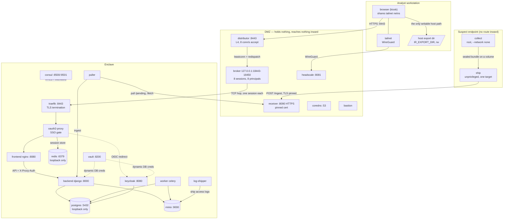
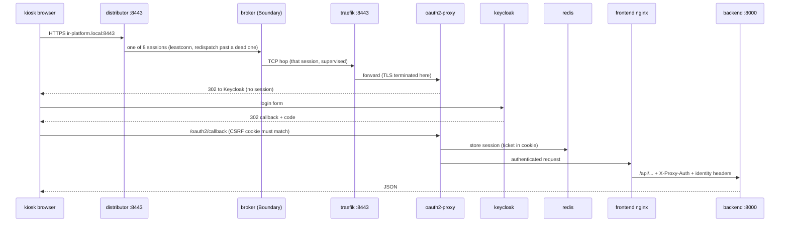
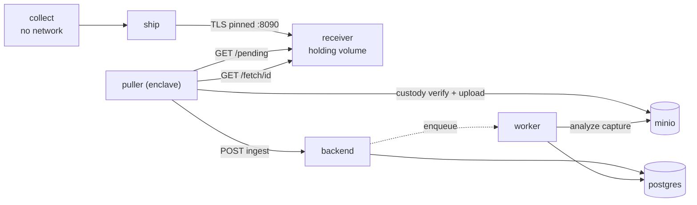
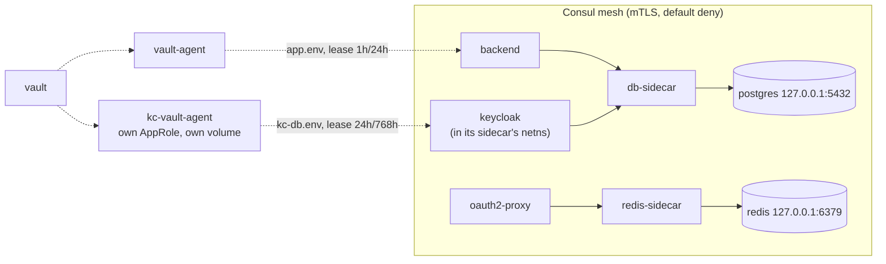

# Component topology — what talks to what, over which port

Companion to `CODE_GRAPH.md`, which shows how the *code* fits together. This shows how the
*running system* does: every hop an analyst's request or a piece of evidence takes, the port
and protocol it uses, and what refuses it if it goes anywhere else.

Read it as a fault tree. A symptom belongs to one hop; find the hop, then §5 names the check
for it. Most of the time lost in this platform's failures has gone into deciding *which
component* was wrong, not into fixing it.

---

## 1. The whole stack



**Direction is the invariant.** Evidence moves inward only, and every inward hop is *pulled*
by the enclave (`puller` dials the receiver) rather than pushed. Nothing in the DMZ holds an
enclave credential; nothing on the analyst side reaches anything but the broker.

## 2. The analyst path, hop by hop

The path most failures land on. Each arrow is a place a request can die.



| Symptom | Hop | Cause |
|---|---|---|
| `PR_END_OF_FILE_ERROR` | broker | Boundary session ended; supervisor re-establishes |
| `400 Header Or Cookie Too Large` | nginx | CSRF cookies accumulated — capped at the gate, not absorbed by buffers |
| Keycloak "We are sorry" | callback | CSRF cookie gone/evicted; **refresh cannot fix it** — it resubmits the dead callback |
| `Invalid username or password` | keycloak | Account absent, brute-force lockout, or a stray pasted character — identical on screen; `admin/kc-userctl.sh status <user>` splits them |
| `Account is not fully set up` (direct grant) | keycloak | A pending required action (forced reset, incomplete profile) — the password was CORRECT |
| Keycloak exits at start, `EOFException ... enableSSL` | db-sidecar | Its database path dies mid-handshake: intention denied, or the db was recreated under an attached proxy — compare netns inodes |
| 502 from ingress | sidecar | A meshed service lost its DNS alias (netns owner must carry `aliases:`) |
| 403 on an API call | backend | RBAC group mapping, or `X-Proxy-Auth` secret mismatch |
| Browser dies on export/download | kiosk | "ask where to save" opens a GTK dialog this container cannot render — `useDownloadDir` must be true with `browser.download.dir` set |
| Export succeeded but the file is nowhere | kiosk mount | It landed inside the ephemeral container: `podman inspect ir-workstation_browser_1` must show a host source for `/home/analyst/downloads` |

## 3. Evidence path



Custody is verified **twice** — at the receiver and again by the puller before ingest — so a
bundle altered in the DMZ is refused at the boundary it was altered behind.

**Evidence leaves by exactly one path: an export.** `/api/findings/export/` writes the audit
ledger first, then the kiosk saves into the one host directory bind-mounted at
`/home/analyst/downloads` (`IR_EXPORT_DIR`, resolved per platform by `deploy.sh`). No picker
is offered — the analyst cannot redirect it — and nothing else in that container can write to
the host. So "what left the platform" is answerable from the ledger alone.

## 4. Mesh and identity

Every enclave service rides the mesh; `postgres`, `redis` and `minio` bind **loopback only**,
so a consumer reaches them exclusively through its sidecar. A pair with no Consul intention is
refused on the wire, not merely unrouted.



**Databases are separated by privilege.** Keycloak has its own database with `REVOKE CONNECT`
against the application role, so password hashes are not reachable from the web tier even if
a query were written for them. The reciprocal holds — `kc_app` cannot open either evidence
database — and the static admin credential lives in `deploy/.env.db`, loaded only by the data
tier: every application connection is a Vault-issued non-superuser. Keycloak's lease is
deliberately long-lived: it pools connections and cannot re-read a rotated credential without
a restart, so the lease outlives the deploy cadence and every deploy mints a fresh one.
Proven end to end by `test/uat_keycloak_db.sh`.

## 5. Where to look first

Ordered by how often it is the answer.

| Check | Command |
|---|---|
| Is the tier even up? | `podman ps --format '{{.Names}} {{.Status}}'` |
| Did a UAT tear it down? | `uat_full_stack.sh` runs `down all` unless **`KEEP_UP=1`** |
| Broker sessions alive? | `podman logs ir-dmz_broker_1 \| grep -E "listening on session\|re-establish"` |
| All session listeners bound? | `podman exec ir-dmz_bastion_1 sh -c 'netstat -ltn \| grep -c ":184"'` — expect `BROKER_SESSIONS` |
| Distributor carrying? | `podman logs --tail 20 ir-dmz_distributor_1` — one line per connection, `brokered/sN` names the session |
| Accounts exist? | `admin/kc-userctl.sh status default-admin` |
| Keycloak's credential rendered? | `podman exec ir-enclave_kc-vault-agent_1 grep -c KC_DB_PASSWORD /vault/secrets/kc-db.env` |
| Keycloak on its store? | `psql -U ir_platform -c "SELECT usename FROM pg_stat_activity WHERE datname='keycloak'"` in the db container |
| Mesh pair permitted? | `podman exec ir-enclave_consul_1 consul intention check <src> <dst>` |
| Sidecar orphaned? | deploy prints `… is orphaned from its service's namespace` |
| Is the container running the image you built? | compare `podman inspect <c> --format '{{.Image}}'` against `podman image inspect <tag> --format '{{.Id}}'` |
| Evidence stuck in the DMZ? | `curl --cacert dmz/certs/receiver.crt https://receiver:8090/pending` |

**Three traps worth knowing before they cost an hour.**

*Rebuilt image, unchanged behavior.* `launch.sh`, `policies.json` and every entrypoint are
baked into images. A deploy reuses an existing container, so a rebuild alone changes nothing
in front of the user — remove the container, then deploy.

*Removing a namespace owner hangs.* Where one container shares another's network namespace
(browser↔tailnet, service↔sidecar), removing the **owner** while the consumer holds it can
hang while holding the storage lock, and the host looks seized. Remove the consumer first.

*Every podman call hangs after a host suspend.* A `podman rm`/`up` in flight when the host
slept wakes up wedged and keeps the storage lock; every later call queues behind it with no
error. Find the wedged one by age, kill it, and the queue drains:

```bash
ps -eo pid,etime,cmd | grep -E "podman( |$)" | grep -vE "conmon|netavark|aardvark"
```

A deploy interrupted this way is safe to re-run — every stage converges.
